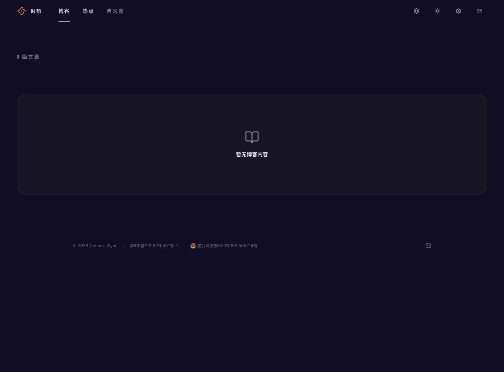
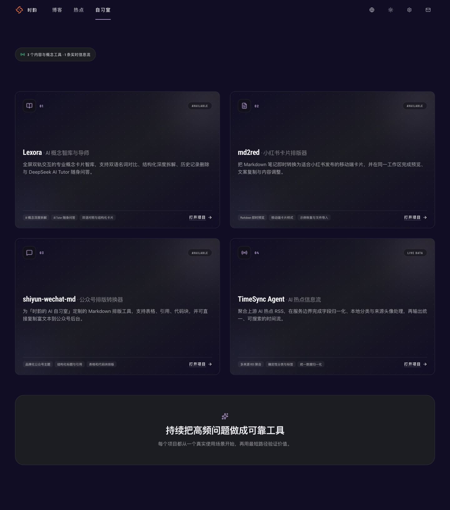
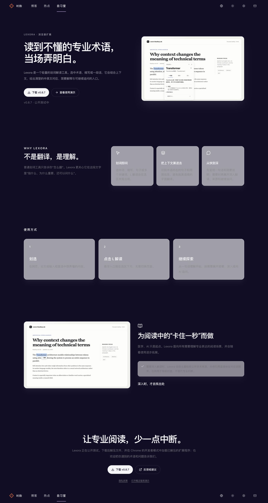
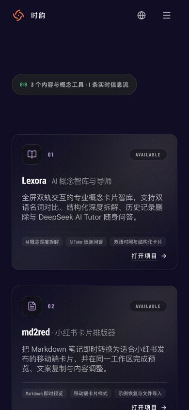
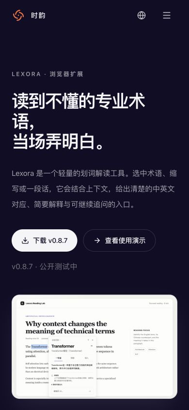
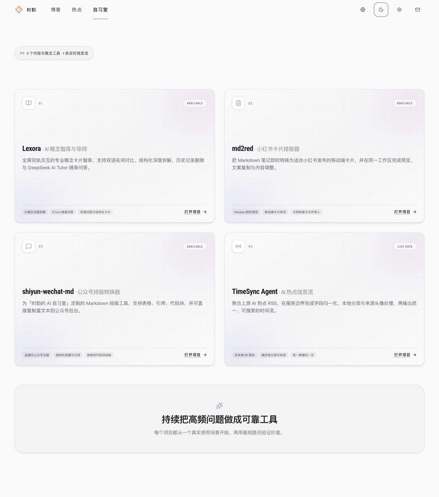

# TemporalSync 视觉与风格审计

日期：2026-07-30

## 审计范围

- 页面：首页/博客、自习室、Lexora 介绍页
- 模式：深色桌面、浅色桌面、390 × 844 移动端
- 目标：判断当前网站在品牌一致性、视觉层级、排版、色彩、响应式和可访问性方面是否仍有美化空间

## 总体判断

网站已经具备成熟产品的基础骨架：导航克制、留白充分、卡片系统完整、移动端主要布局可用。当前最需要解决的不是“增加更多装饰”，而是统一品牌语言并修复深色模式下的表面对比。现状大约处于“结构完成、视觉系统尚未完全收口”的阶段。

## 审计步骤

### 1. 首页/博客 · 深色桌面

健康度：需要改进。

- 导航与页脚视觉稳定，但首页在本地数据为空时只剩一个巨大的空状态，第一印象接近“网站尚未完成”。
- 空状态卡片占据大量面积，却没有解释、推荐入口或返回路径。
- 页面没有品牌主张、精选内容或项目入口，无法承担网站首页的入口职责。

### 2. 自习室 · 深色桌面

健康度：基本健康，层级仍可加强。

- 四张项目卡片结构一致、信息完整，暗色质感和点阵背景较统一。
- 页面定义了标题、说明和 eyebrow 文案，但实际首屏只显示一个状态胶囊，导致上方留白偏多，缺少明确的页面标题。
- 卡片全部采用同一视觉模板，项目差异主要依赖文字；在快速浏览时，Lexora、md2red 和热点流缺少各自的视觉记忆点。
- 桌面卡片固定为 3:2，正文集中在中下部，卡片内部存在偏大的无意义空白。

### 3. Lexora · 深色桌面

健康度：存在高优先级视觉缺陷。

- Hero 是当前网站表现最强的区域：标题直接、产品截图可信、双 CTA 清楚。
- 中段卡片在深色主题下显示为浅灰表面，同时正文仍使用灰色文字，造成严重的低对比问题。
- 实测首张卡片背景为 `white / 60%`，正文为 `rgb(134, 134, 139)`；两者叠加后的视觉对比明显不足。
- 页面存在大段相似的三列卡片，缺少节奏变化；“为什么”“使用方式”两个区域远看容易混在一起。
- Lexora 使用紫色/灰色玻璃质感，TemporalSync 导航使用橙色 Logo、粉紫色激活线，两套品牌语言尚未建立明确的主从关系。

### 4. 自习室 · 移动端

健康度：良好，有细节风险。

- 单列卡片重排自然，左右边距和触控区域合理。
- 信息标签和状态文字使用约 10px 字号，真实手机上偏小；它们不是纯装饰信息，建议提升至至少 11–12px。
- 卡片中的功能标签数量较多，首屏密度略高，可以只保留两个核心能力。

### 5. Lexora · 移动端

健康度：良好。

- Hero 的阅读顺序、按钮尺寸和产品截图表现稳定。
- 主标题在 390px 宽度下出现“专业术 / 语”的生硬断行；应使用更平衡的字号、最大宽度或中文换行策略。
- 正文行长合理，但正文灰度略低，长时间阅读时会显得偏淡。

### 6. 自习室 · 浅色桌面

健康度：可用但偏“洗白”。

- 结构和可读性没有明显问题。
- 页面背景、卡片、点阵纹理和边框都集中在非常浅的灰白区间，层级主要依赖阴影，导致整体缺乏明确焦点。
- 颜色点缀分散在淡紫、绿色和橙色之间，没有形成一个稳定的品牌强调色规则。

## 优先级建议

### P0：先修复深色模式的 Lexora 卡片

- 不再使用深色页面上的 `bg-white/60` 作为大面积表面。
- 用语义化的 `ts-surface` / `ts-surface-elevated` 统一深色表面。
- 正文颜色至少提升到当前深色正文色，并实测卡片正文、辅助文字与按钮的对比度。
- 检查 Tailwind `dark:` 变体是否与项目通过 `.dark` class 切换主题的方式一致。

### P1：统一品牌颜色和页面身份

- 明确一套角色，而不是让所有颜色都成为主色：
  - 黑白：基础结构；
  - 新 Logo 的黄、橙、红、紫：品牌轨道或栏目识别；
  - 绿色：只用于实时/成功状态。
- 导航激活线、主按钮、链接、图标和状态色使用同一套角色规则。
- 统一“时韵 / TemporalSync / TSync / TimeSync Agent”的视觉命名层级。

### P1：给首页和自习室补足首屏层级

- 首页不应只依赖博客数据；至少保留一个稳定的品牌介绍、精选项目或最新内容区域。
- 空状态增加说明和去往“自习室/热点”的明确入口。
- 自习室恢复已存在但未展示的标题与副标题，缩减顶部无目的留白。

### P1：收紧卡片系统

- 将项目卡片从“同模板四次复用”改为“同结构、不同识别”：每个项目增加真实截图、局部品牌色或独有图形之一。
- 桌面端减少卡片高度，避免正文只挤在卡片中下部。
- 建立 2–3 个表面层级，减少玻璃、渐变、点阵、光晕和阴影同时出现。

### P2：调整字体策略

- 当前同时加载多套字体，并强制所有标题、导航使用 `Roboto Condensed`；它不包含中文字符，中文会回退到系统字体，导致中英文节奏不一致。
- 建议：中文标题使用稳定的中文无衬线字体栈；`Roboto Condensed` 或 `Barlow Condensed` 仅用于英文标签、数字和状态。
- 移动端大标题增加平衡换行规则，避免单个汉字掉到下一行。

### P2：提升辅助文字

- 10px 状态、标签和元数据在移动端过小。
- 深色模式中多处 `text-ts-muted` / 低透明度文本偏暗。
- 浅色模式需要通过表面色差和边框，而不是只依赖阴影建立层级。

## 已有优势

- 全站导航简单，桌面与移动端的主要入口清楚。
- 交互控件普遍具有约 44px 触控尺寸，并配置了 focus ring。
- 代码已考虑 `prefers-reduced-motion`，动画不是唯一的信息载体。
- Lexora Hero 和自习室移动端已经接近可发布质量，适合作为下一轮统一设计的基准。

## 证据限制

- 本地博客数据为空，因此无法评价文章卡片有真实封面和真实内容时的完整表现。
- 截图可以识别明显的对比、字号、层级和响应式风险，但不能证明完整 WCAG 合规。
- 本次没有遍历全部工具页、后台页，也没有完成完整键盘操作和屏幕阅读器测试。
