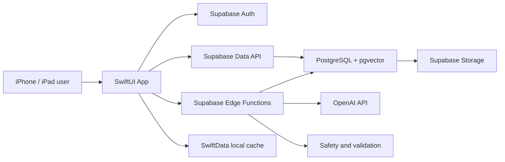
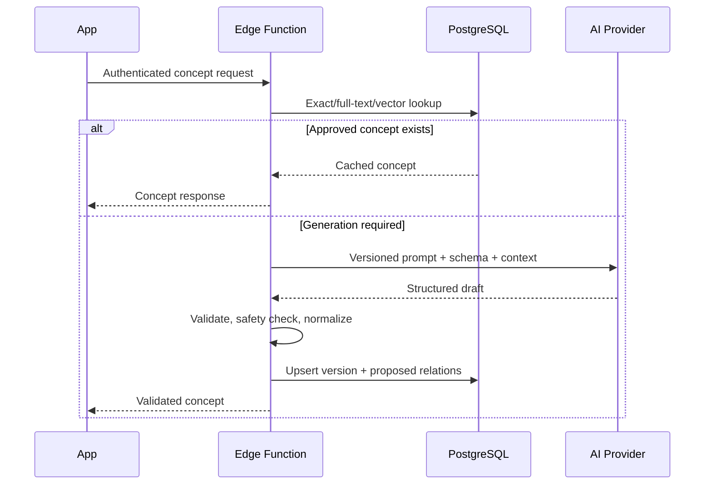
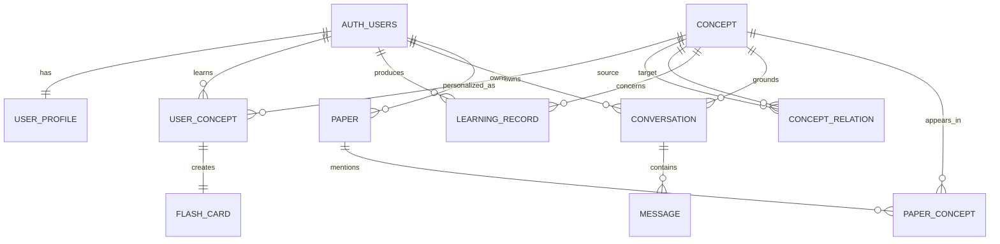
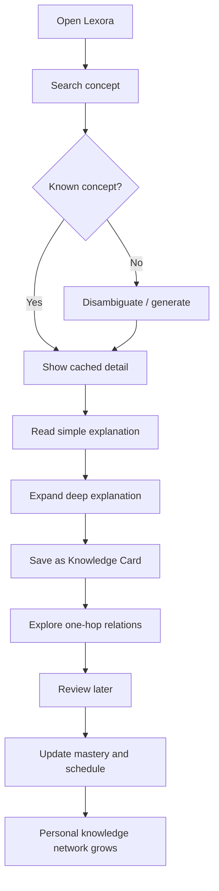

# Lexora — Product Requirements & Technical Design

**Document status:** Draft for founder review  
**Product:** Lexora — AI Knowledge Companion  
**Version:** V1 / MVP design  
**Date:** 2026-07-17  
**Owner:** Product & Engineering  

---

## 0. Executive Summary

### 0.1 Product definition

Lexora is an AI knowledge companion for people who repeatedly encounter unfamiliar professional concepts while reading, studying, or working.

It is not a dictionary and not a generic chatbot. Its core loop is:

> Turn an unfamiliar term into an understandable, connected, and memorable node in the user's personal knowledge network.

### 0.2 V1 product promise

A user can search a professional term and, within one session:

1. Understand it at two levels of depth in Chinese and English.
2. Hear its English pronunciation and inspect related concepts.
3. Save it as a learning card.
4. Review it through AI-generated questions.
5. See how it connects to concepts already learned.
6. Track whether it is new, learning, or mastered.

### 0.3 V1 scope principle

V1 validates one assumption:

> Users will return to Lexora if every search improves a persistent personal knowledge system instead of producing a disposable answer.

The MVP therefore prioritizes the learning loop over breadth. Social features, community, monetization, shared workspaces, web apps, Android, autonomous multi-agent orchestration, full PDF parsing, and publication-grade citation management are excluded.

### 0.4 Product guardrails

- **Learning, not diagnosis:** Medical content is educational and must not be presented as diagnosis or treatment advice.
- **Explain uncertainty:** AI output must distinguish established definitions, simplified analogies, and uncertain or context-dependent claims.
- **Source-aware:** Deep explanations should include a small set of reputable reference links or source labels.
- **Progressive disclosure:** Start simple; reveal depth only when requested.
- **One-person buildable:** Prefer platform-native capabilities and managed infrastructure.

---

# 1. Product Analysis

## 1.1 Core user profiles

### Persona A — Cross-domain learner

- **Examples:** Graduate student, researcher, knowledge worker, product manager.
- **Behavior:** Reads papers, reports, documentation, and technical articles across unfamiliar fields.
- **Need:** Quickly establish a usable mental model without opening ten browser tabs.
- **Current workaround:** Search engine + Wikipedia + notes + occasional flashcards.
- **Failure mode:** The answer is understood temporarily but forgotten or disconnected from prior knowledge.

### Persona B — Early-career professional

- **Examples:** Junior doctor, biomedical researcher, ML engineer, technical analyst.
- **Behavior:** Encounters specialized vocabulary during work and needs accurate contextual understanding.
- **Need:** Switch between concise explanation and domain-level detail.
- **Current workaround:** Domain references, colleagues, ChatGPT, personal notes.
- **Failure mode:** Generic explanations are too shallow; expert references are too dense.

### Persona C — Serious self-learner

- **Examples:** Career switcher learning AI, biology, medicine, or engineering.
- **Behavior:** Learns through courses, books, and papers without a formal curriculum.
- **Need:** Build a coherent concept map and remember prerequisites.
- **Current workaround:** Notion databases, YouTube, Quizlet, handwritten notes.
- **Failure mode:** Accumulates content but cannot see structure or measure mastery.

## 1.2 First target users

The first target should be:

> Chinese-speaking postgraduate students and early-career knowledge workers who read English AI/ML, biomedical, or interdisciplinary papers on iPhone or iPad.

Reasons:

- They have frequent, high-intent concept lookup behavior.
- Bilingual explanation is a strong immediate advantage.
- They already experience fragmentation between search, note-taking, and memorization.
- AI/ML and biomedical concepts have enough relational structure to demonstrate the knowledge graph.
- They are reachable through university, research, and technical-content communities without requiring a broad consumer launch.

V1 should support all named domains in its taxonomy, but launch messaging should focus on **AI/ML + biomedical research**. Engineering and broader science remain supported, not separately optimized.

## 1.3 User pain points

| Pain point | Existing behavior | Why it remains unsolved | Lexora response |
|---|---|---|---|
| Explanations are too shallow or too technical | Search multiple sources | Reading level is not adaptive | Simple and deep explanation modes |
| English terms are hard to map to Chinese concepts | Translate and search separately | Translation loses domain meaning | Canonical English term + Chinese explanation + aliases |
| Knowledge is fragmented | Save links and notes | No normalized concept identity | One canonical concept node with personal state |
| Users forget what they searched | Re-search the same term | Lookup is not a learning event | Automatic learning card and review |
| Related concepts are invisible | Follow hyperlinks manually | Links do not express relation types | Typed concept relationships |
| Generic chat answers are hard to trust | Ask follow-up questions | Answers lack structure and provenance | Structured output, uncertainty, references |
| Note systems require maintenance | Build Notion templates | High organization overhead | Automatic card, relation, and progress updates |

## 1.4 Core use cases

### Scenario 1 — Reading a paper

The user encounters “amyloid beta,” searches it, reads a one-sentence explanation, expands the deep explanation, then saves it. Lexora shows that it relates to Alzheimer’s disease and mild cognitive impairment, two concepts already in the user's knowledge base.

### Scenario 2 — Preparing for a meeting or class

The user searches several unfamiliar concepts, saves the important ones, and later opens Learning to complete a five-card review. Incorrect answers lower mastery and schedule an earlier review.

### Scenario 3 — Building cross-domain understanding

The user searches “embedding” in an ML context. Lexora disambiguates it from mathematical and linguistic meanings, explains the selected sense, and connects it to vector databases, cosine similarity, and transformers.

### Scenario 4 — Returning to a forgotten term

The user searches a previously saved concept. Lexora shows the existing card, last review, mastery state, personal note, and nearby learned concepts instead of creating a duplicate.

## 1.5 Competitive differentiation

| Product | Primary job | Strength | Limitation for Lexora's job | Lexora differentiation |
|---|---|---|---|---|
| Anki | Memorize prepared facts | Powerful spaced repetition | High card-authoring effort; weak discovery and concept graph | Search-to-card automation with semantic relations |
| Quizlet | Study sets and quizzes | Easy study modes and shared content | Set-centric, often shallow, limited personal graph | Concept-centric learning with adaptive depth |
| Notion | Organize information | Flexible databases and notes | Requires manual schema, linking, and maintenance | Opinionated zero-maintenance knowledge workflow |
| Wikipedia | Reference knowledge | Broad, linked, source-rich | Often too long; not personalized; no mastery state | Progressive explanation tied to personal learning |
| Generic AI chat | Answer questions | Flexible conversation | Answers are disposable and inconsistent in structure | Persistent canonical concepts, cards, relations, progress |

Lexora's defensible product unit is not “an AI explanation.” It is:

> A normalized concept object with trusted explanation, typed relationships, personal learning state, review history, and conversational context.

## 1.6 Product success metrics

### North-star metric

**Weekly Learned Concepts (WLC):** Number of unique concepts per active user that receive a meaningful learning action in a week: saved, reviewed, marked understood, or used in tutor conversation.

### MVP funnel

- Search success rate: search produces a selected concept or useful disambiguation.
- Search-to-save conversion.
- Saved concept-to-first-review conversion within seven days.
- Week-2 retained learners.
- Concepts reviewed per weekly active learner.
- Duplicate concept rate.
- AI generation failure and retry rate.

### V1 quality targets

- Cached concept detail: perceived load under 1 second on normal connectivity.
- New AI explanation: first meaningful content target under 5 seconds, full response target under 12 seconds.
- Structured response parse success: at least 99%.
- Crash-free sessions: at least 99.5%.
- Search-to-save conversion target for qualified beta users: at least 25%.
- At least 30% of saved concepts receive a review within seven days.

These are launch hypotheses, not promises. They should be recalibrated after a 30–50 user private beta.

---

# 2. MVP Feature Design

## 2.1 V1 information model

The product has four primary objects:

- **Concept:** Shared canonical knowledge, such as “Alzheimer’s disease.”
- **Relation:** A typed edge between two concepts, such as “MCI may precede Alzheimer’s disease.”
- **Knowledge Card:** The user's saved, reviewable version of a concept.
- **Learning Record:** Events and current mastery state for that user and concept.

The distinction between shared and personal data is essential:

- A concept explanation can be reused across users and versioned.
- Save state, notes, conversations, and mastery always belong to one user.

## 2.2 Concept Search

### User story

As a learner, I want to search an unfamiliar professional term and receive a clear, bilingual, domain-aware explanation so I can continue reading without losing context.

### V1 behavior

1. User enters a term, phrase, acronym, or Chinese translation.
2. Search checks canonical names and aliases first.
3. Semantic search retrieves close existing concepts.
4. If the term is ambiguous, the user selects a domain/sense.
5. If an approved concept exists, return it immediately.
6. Otherwise, the backend generates a structured concept draft, validates it, persists it, and returns it.

### Concept response content

- Canonical English name.
- Chinese name.
- English definition.
- Chinese definition.
- Pronunciation:
  - IPA where reliable.
  - Native device text-to-speech for the English term in V1.
- One-sentence simple explanation.
- Optional analogy, explicitly labeled as an analogy.
- Deep explanation:
  - Definition and mechanism.
  - Why it matters.
  - Typical context or application.
  - Common misconception.
- Domain and subdomain.
- Aliases and acronym expansion.
- Related concepts with typed relations.
- Confidence/quality status.
- Two to five reputable references for the deep explanation when available.

### Scope controls

- V1 supports text input only; camera/OCR and system share extension are deferred.
- Explanations are generated once and cached by normalized term, sense, locale, prompt version, and model version.
- Users cannot publicly edit canonical concepts in V1.
- If confidence is low, the app shows “needs verification” and avoids representing the content as authoritative.

### Edge cases

- **Acronym ambiguity:** “MRI” is clear; “MCI” may need domain confirmation.
- **Multiple meanings:** “Embedding” requires sense selection.
- **Misspelling:** Return suggested canonical terms.
- **No safe answer:** Explain that the concept could not be reliably resolved and invite refinement.
- **Medical query phrased as symptoms:** Keep the response educational and show a medical safety boundary; do not diagnose.

## 2.3 Knowledge Card

### User story

As a learner, I want to save a concept without manually writing flashcards so I can review it later.

### V1 card creation

Saving a concept creates one Knowledge Card containing:

- Concept name and domain.
- Front prompt: “What is X?” or a context-sensitive question.
- Back answer: concise explanation.
- Key points: two to four items.
- One generated recall question.
- Optional user note.
- Current mastery state.
- Next review date.

### Review modes

V1 contains one focused review flow:

1. Show question.
2. User thinks or types a short answer.
3. Reveal model answer.
4. AI optionally evaluates a typed answer as incorrect, partial, or correct.
5. User confirms self-rating: Again / Hard / Good / Easy.
6. Scheduling updates.

V1 does not include decks, shared sets, custom templates, cloze deletion, image occlusion, or competitive quizzes.

### Scheduling

Use a small deterministic spaced-repetition algorithm in V1. The schedule must remain interpretable and testable; AI can evaluate content but does not control review timing. Store scheduling fields so the algorithm can later migrate to FSRS without changing the product model.

## 2.4 Knowledge Relation

### User story

As a learner, I want to see how a concept relates to what I already know so I can build a coherent mental model.

### Supported V1 relation types

- `is_a` — category membership.
- `part_of` — structural membership.
- `prerequisite_of` — useful prior knowledge.
- `associated_with` — meaningful non-causal association.
- `causes` — causal relationship, only when adequately supported.
- `measured_by` — measurement or diagnostic relation.
- `used_for` — application relation.
- `contrasts_with` — useful comparison.
- `related_to` — fallback when a more precise relation is not justified.

Relations are directional where the meaning requires it. The UI renders a human-readable label in Chinese or English.

### V1 graph behavior

- Concept Detail shows the nearest five to eight relations as a list.
- Knowledge Graph shows a focused graph centered on one concept.
- Initial graph depth is one hop; the user can expand one neighboring node at a time.
- Nodes already saved by the user have a distinct visual state.
- Tapping a node opens its preview; a second action opens Concept Detail.
- V1 does not attempt to render the entire global graph.

Example:

```text
Alzheimer's Disease
 ├── may be preceded by → Mild Cognitive Impairment
 ├── may be evaluated with → MRI
 ├── documented in → EHR
 └── associated with → Amyloid β
```

## 2.5 Personal Knowledge Base

### User story

As a learner, I want Lexora to remember what I learned and what needs review so each lookup contributes to long-term progress.

### V1 states

- **New:** Viewed but not saved.
- **Learning:** Saved or reviewed but not yet stable.
- **Mastered:** Meets the deterministic mastery threshold.
- **Needs review:** Review is due or recent performance declined.

### Personal data shown

- Saved concepts.
- Recently viewed concepts.
- Due reviews.
- Review streak, used carefully and not as the main value proposition.
- Domain distribution.
- Total learning, mastered, and due counts.
- Per-concept review history and last activity.

### Mastery rule

The UI may show a 0–100 mastery score, but the stored truth should be derived from review outcomes, intervals, lapse count, and recency. “Mastered” is reversible and must not imply professional competence.

## 2.6 Explicitly out of scope for V1

- Social graph, follows, comments, public profiles.
- Community-created content or moderation workflows.
- Payments, subscriptions, paywalls.
- Android, web, watchOS, macOS.
- User-created decks and complex card templates.
- Full paper PDF upload, parsing, highlighting, citation manager.
- OCR, camera lookup, browser extension, iOS share extension.
- Autonomous agents, agent-to-agent handoffs, long-running plans.
- Fine-tuning custom models.
- Collaborative knowledge bases.
- Offline AI generation.

## 2.7 MVP release criteria

V1 is complete only when a new user can:

1. Sign in with Apple.
2. Search at least one ambiguous and one unambiguous concept.
3. Receive a valid bilingual explanation with pronunciation.
4. Save a concept and avoid duplicate cards.
5. Complete a review and see the next review change.
6. Open a one-hop graph and navigate to a related concept.
7. View learning progress across relaunches and devices.
8. Delete their account and personal data through the app.

---

# 3. Technical Architecture

## 3.1 Architecture principles

- Native iOS experience before cross-platform reach.
- Managed services before custom infrastructure.
- The mobile client never calls the model provider directly.
- AI output is untrusted input: validate, version, moderate, and observe it.
- Canonical knowledge and personal learning data have separate access models.
- Cache stable explanations; do not regenerate on every view.
- Use deterministic code for identity, permissions, scheduling, and progress.
- Agents are bounded server workflows, not autonomous actors.

## 3.2 System context



## 3.3 Client architecture

### Platform choice

- **Framework:** SwiftUI.
- **Minimum target:** iOS/iPadOS 17, to balance modern APIs and device coverage.
- **Architecture:** Feature-oriented modular monolith with unidirectional state flow.
- **Navigation:** `NavigationStack` on iPhone; `NavigationSplitView` for iPad where it improves browsing.
- **Concurrency:** Swift structured concurrency (`async/await`).
- **Local persistence:** SwiftData for cached concepts, saved cards, pending learning events, and lightweight offline reading.
- **Audio:** `AVSpeechSynthesizer` for V1 term pronunciation.
- **Observability:** OSLog locally plus a privacy-conscious crash and performance service.

### Client layers

| Layer | Responsibility |
|---|---|
| App | Lifecycle, dependency composition, deep links |
| DesignSystem | Semantic colors, typography, spacing, reusable components |
| Features | Home, Search, Concept, Graph, Learning, Profile, Auth |
| Domain | Concept, relation, card, progress, conversation models and use cases |
| Data | Supabase repositories, local cache, sync policy |
| Core | Networking, auth session, telemetry, error mapping |

### State and data flow

- Views render immutable feature state and send user intents.
- Feature models coordinate domain use cases.
- Repositories decide whether to return cached or remote data.
- Writes use remote-first behavior when online.
- A small pending-event queue retries learning events after reconnection.
- V1 offline support is read-only for previously cached concepts/cards plus queued review results; it does not promise complete offline functionality.

### iPad adaptation

- Sidebar: Home, Search, Knowledge, Learning, Profile.
- Content column: concept list or graph controls.
- Detail column: concept detail or card review.
- Preserve readable text width instead of stretching articles edge to edge.
- Support keyboard navigation and common shortcuts for Search and Save.

## 3.4 Backend architecture

### Supabase responsibilities

- **Auth:** Sign in with Apple first; email magic link may be added for beta/admin access.
- **PostgreSQL:** Source of truth for concepts, relations, personal learning, conversations, and paper metadata.
- **pgvector:** Semantic concept retrieval and duplicate detection.
- **Edge Functions:** Trusted AI gateway, rate limiting, structured validation, provider calls, and orchestration.
- **Storage:** Future paper PDFs and optional generated audio assets; avatars are unnecessary in V1.
- **Realtime:** Not required for V1. Normal request/refresh is sufficient.

### Public and private boundaries

- The iOS app uses only a Supabase publishable key.
- Model provider keys and service-role credentials exist only in server-side secrets.
- All exposed tables have RLS.
- User-owned rows require an ownership predicate based on `auth.uid()`.
- Canonical concepts are readable by authenticated users but writable only through trusted backend workflows.
- Internal generation jobs, raw model traces, rate limits, and audit data live in a non-exposed schema.
- Authorization must never rely on user-editable metadata.

### Core backend endpoints

| Endpoint/workflow | Purpose | Auth | Main result |
|---|---|---|---|
| Search concepts | Exact, alias, full-text, then semantic retrieval | Required | Ranked concept candidates |
| Explain concept | Generate/resolve a canonical concept | Required + rate limit | Validated concept and relations |
| Save concept | Create personal card and learning state | Required | Card + initial schedule |
| Submit review | Record outcome and update schedule | Required | New mastery and due date |
| Tutor message | Contextual Q&A about one concept | Required + rate limit | Answer + references/suggestions |
| Graph neighborhood | Fetch one-hop local graph | Required | Nodes and typed edges |
| Delete account | Remove/anonymize personal data | Re-auth recommended | Deletion status |

### Search strategy

Search should be hybrid and staged:

1. Exact canonical term and normalized alias.
2. Prefix/trigram match for typos and acronyms.
3. PostgreSQL full-text search over names and definitions.
4. pgvector semantic similarity over a compact concept representation.
5. Domain and language-aware reranking.

Do not use vector search as the only identity mechanism. One canonical concept may have many aliases, while identical words can represent different senses.

### Vector strategy

- Store one embedding per concept version or embedding model version.
- Embed canonical name, aliases, domain, and concise definition, not the entire conversation history.
- Use cosine distance consistently.
- Begin with exact search while the dataset is small; add HNSW when scale or latency measurements justify it.
- HNSW is the preferred production index because it tolerates evolving data better than IVFFlat.
- Record the embedding provider, model, dimension, and created timestamp to allow future migrations.

## 3.5 AI layer

### Important design choice

“Agent” in V1 means a named, bounded backend workflow with a strict input/output schema. It does not mean a persistent autonomous agent. Each workflow has:

- One explicit task.
- A curated prompt.
- A fixed set of retrieved context.
- Structured output validation.
- Time, token, and retry limits.
- Versioned inputs and outputs.

### A. Concept Explanation Agent

**Responsibility**

- Resolve the intended concept sense.
- Generate bilingual, level-appropriate explanation content.
- Identify aliases, pronunciation metadata, misconceptions, and references.

**Input**

- Raw query.
- Preferred locale.
- Optional domain hint.
- Optional source sentence supplied by the user.
- Existing candidate concepts.
- Desired depth.
- Prompt version and safety context.

**Output**

- Canonical English and Chinese names.
- Sense/domain identifier.
- English and Chinese definitions.
- Simple and deep explanations.
- IPA if reliable.
- Aliases and acronym expansion.
- Key points and misconception.
- Suggested related concepts.
- Reference metadata.
- Confidence and warnings.

**Controls**

- Structured JSON schema.
- Normalize and deduplicate before insertion.
- Reject unsupported relation types.
- Medical safety classifier and disclaimer.
- Human-readable failure state rather than fabricated certainty.
- Cache by normalized input and content version.

### B. Knowledge Graph Agent

**Responsibility**

- Propose typed relationships between the current concept and existing canonical concepts.
- Explain the relation in one sentence.
- Avoid duplicate, circularly mislabeled, or overconfident causal edges.

**Input**

- Validated concept.
- Top semantic and lexical candidate concepts.
- Existing one-hop neighborhood.
- Allowed relation-type vocabulary.
- Reference snippets or source metadata.

**Output**

- Source concept ID.
- Target concept candidate or canonical ID.
- Relation type and direction.
- Short bilingual label.
- Confidence.
- Evidence/reference pointer.
- Review status.

**Controls**

- The agent proposes; deterministic validation persists.
- `causes` requires stronger evidence than `associated_with`.
- Low-confidence edges remain hidden from normal users.
- No recursive graph expansion in V1.

### C. Tutor Agent

**Responsibility**

- Answer questions about a selected concept.
- Adjust explanation depth based on user mastery and conversation.
- Generate and evaluate recall questions.

**Input**

- Selected concept and approved explanation.
- Nearby approved relations.
- User mastery summary, not full unrelated profile.
- Recent conversation turns within a bounded window.
- User question or review answer.
- Requested language.

**Output**

- Direct answer.
- Optional step-by-step explanation.
- Relation to known concepts.
- One suggested follow-up question.
- For review: incorrect/partial/correct assessment with short feedback.
- References or “based on saved concept” provenance.

**Controls**

- Tutor cannot alter canonical concepts.
- Tutor assessment is advisory; the user can override it.
- Conversation context has a fixed token budget and is summarized when needed.
- Prompt injection in paper text or user-provided context is treated as content, not instructions.

## 3.6 AI request lifecycle



## 3.7 Reliability, privacy, and safety

### Reliability

- Idempotency key on explanation and save-card workflows.
- At most one active generation job for a normalized concept/sense/version.
- Two retries only for transient provider or schema failures.
- Graceful fallback to existing cached content.
- Provider/model can be swapped behind the backend contract.

### Privacy

- Collect only account identifier, learning state, app telemetry, and user-provided content needed for the feature.
- Do not send unrelated profile data to the model.
- Redact obvious personal identifiers from paper snippets and tutor context where feasible.
- Provide in-app account deletion and data export path.
- Declare model-provider processing and analytics behavior in the privacy policy and App Store privacy labels.
- Define retention windows for raw AI request logs; store hashes/metrics rather than raw prompts when debugging value is low.

### Professional knowledge safety

- Display “educational information, not professional advice.”
- Medical answers must not infer a diagnosis from symptoms.
- Surface reference date/version because scientific understanding changes.
- Record content status: `draft`, `approved`, `needs_review`, or `deprecated`.
- Allow users to report inaccurate content.

## 3.8 Observability and cost controls

- Log request ID, user ID hash, workflow, latency, token usage, cache hit, model, prompt version, schema status, and error category.
- Never log service keys or raw auth tokens.
- Per-user daily AI quotas even before monetization, to prevent abuse.
- Cache canonical explanations across users.
- Use smaller/cheaper models for classification, disambiguation, and answer evaluation; use a stronger model only for difficult explanation generation.
- Create an offline evaluation set of 100–200 representative concepts across launch domains.

---

# 4. PostgreSQL Data Model

## 4.1 Modeling conventions

- Primary keys use UUID.
- Timestamps use `timestamptz` in UTC.
- Mutable tables include `created_at` and `updated_at`.
- Human-facing enums are implemented as constrained values with a migration path.
- Canonical content is versioned; user learning events are append-oriented.
- Foreign-key columns used in joins, filters, or RLS receive B-tree indexes.
- Soft deletion is used only where recovery/audit needs justify it; account deletion must still satisfy the privacy policy.

## 4.2 Entity relationship overview



## 4.3 Required and supporting tables

### 4.3.1 User — `auth.users` + `user_profiles`

Supabase Auth owns identity in `auth.users`. Application profile data belongs in a separate `user_profiles` table.

| Field | Type | Rules / purpose |
|---|---|---|
| `id` | uuid | PK and FK to `auth.users.id`, cascade delete |
| `display_name` | text nullable | Display only; never authorization |
| `preferred_locale` | text | Default `zh-Hans` |
| `learning_language` | text | Default `en` |
| `domain_preferences` | text[] | Optional onboarding interests |
| `daily_goal` | smallint | Default 5, constrained reasonable range |
| `onboarding_completed_at` | timestamptz nullable | Onboarding state |
| `created_at` | timestamptz | Creation time |
| `updated_at` | timestamptz | Last profile update |

**Relations:** one-to-one with `auth.users`; one-to-many with all user-owned tables.  
**Indexes:** PK on `id`; no index needed for display name in V1.  
**RLS:** owner can select/update own row; insert through account bootstrap; no public reads.

### 4.3.2 Concept — `concepts`

| Field | Type | Rules / purpose |
|---|---|---|
| `id` | uuid | PK |
| `canonical_name_en` | text | Required |
| `canonical_name_zh` | text nullable | Chinese canonical label |
| `normalized_key` | text | Normalized lookup key |
| `sense_key` | text | Distinguishes meanings of the same term |
| `domain` | text | e.g. medicine, ai_ml, biology, engineering |
| `subdomain` | text nullable | More specific classification |
| `aliases` | text[] | Acronyms, spelling variants, translations |
| `definition_en` | text | Concise English definition |
| `definition_zh` | text | Concise Chinese definition |
| `simple_explanation_zh` | text | Plain-language explanation |
| `deep_explanation_zh` | text | Structured deeper content |
| `key_points` | jsonb | Bilingual structured points |
| `misconception` | jsonb nullable | Common misunderstanding |
| `ipa` | text nullable | Verified or confidence-gated |
| `references` | jsonb | Small normalized reference list for V1 |
| `content_status` | text | draft / approved / needs_review / deprecated |
| `confidence` | real | 0–1, not directly presented as truth probability |
| `content_version` | integer | Monotonic version |
| `prompt_version` | text nullable | Generation provenance |
| `model_id` | text nullable | Generation provenance |
| `embedding` | vector(N) nullable | Dimension tied to chosen embedding model |
| `embedding_model` | text nullable | Required when embedding exists |
| `generated_at` | timestamptz nullable | AI generation time |
| `verified_at` | timestamptz nullable | Review time |
| `created_at` | timestamptz | Creation time |
| `updated_at` | timestamptz | Last update |

**Relations:** one-to-many with relations, user concepts, learning records, conversations, and paper mentions.  
**Constraints:** unique `(normalized_key, sense_key, content_version)`; one active approved version per normalized concept sense enforced through workflow/partial uniqueness.  
**Indexes:**

- B-tree on `(normalized_key, sense_key)`.
- GIN on `aliases`.
- Full-text GIN index over canonical names and concise definitions.
- B-tree on `(domain, content_status)`.
- HNSW cosine index on `embedding` when dataset scale justifies it.

**RLS:** authenticated users read approved rows; only trusted backend roles create or mutate canonical content.

### 4.3.3 ConceptRelation — `concept_relations`

| Field | Type | Rules / purpose |
|---|---|---|
| `id` | uuid | PK |
| `source_concept_id` | uuid | FK to concepts |
| `target_concept_id` | uuid | FK to concepts |
| `relation_type` | text | Controlled V1 vocabulary |
| `label_en` | text | Human-readable edge label |
| `label_zh` | text | Human-readable edge label |
| `description` | text nullable | One-sentence explanation |
| `directional` | boolean | Whether reverse meaning differs |
| `confidence` | real | 0–1 |
| `evidence` | jsonb nullable | Reference pointer or rationale |
| `status` | text | proposed / approved / rejected / deprecated |
| `created_by` | text | ai / curator / import |
| `created_at` | timestamptz | Creation time |
| `updated_at` | timestamptz | Last update |

**Constraints:** source and target differ; unique active edge on `(source_concept_id, target_concept_id, relation_type)`; causal relations require approved evidence in workflow.  
**Indexes:** B-tree on source; B-tree on target; B-tree on `(source_concept_id, status)` and `(target_concept_id, status)` for one-hop graph queries.  
**RLS:** authenticated users read approved edges; trusted backend writes.

### 4.3.4 User Concept — `user_concepts`

This supporting table is required to represent the user's personal knowledge base without duplicating canonical concepts.

| Field | Type | Rules / purpose |
|---|---|---|
| `id` | uuid | PK |
| `user_id` | uuid | FK to auth.users |
| `concept_id` | uuid | FK to concepts |
| `state` | text | new / learning / mastered / needs_review |
| `is_saved` | boolean | Collection state |
| `personal_note` | text nullable | Private note |
| `mastery_score` | smallint | Derived 0–100 |
| `first_viewed_at` | timestamptz | First encounter |
| `last_viewed_at` | timestamptz | Recent activity |
| `last_reviewed_at` | timestamptz nullable | Review time |
| `next_review_at` | timestamptz nullable | Due time |
| `review_count` | integer | Derived counter |
| `lapse_count` | integer | Derived counter |
| `created_at` | timestamptz | Creation time |
| `updated_at` | timestamptz | Last update |

**Constraints:** unique `(user_id, concept_id)`.  
**Indexes:** `(user_id, state)`, `(user_id, next_review_at)` with a partial condition for saved/due concepts, `(user_id, last_viewed_at desc)`.  
**RLS:** owner-only CRUD using indexed `user_id`.

### 4.3.5 LearningRecord — `learning_records`

Append-oriented event history; it is the audit trail behind mastery.

| Field | Type | Rules / purpose |
|---|---|---|
| `id` | uuid | PK |
| `user_id` | uuid | FK to auth.users |
| `concept_id` | uuid | FK to concepts |
| `flash_card_id` | uuid nullable | FK to flash_cards |
| `event_type` | text | viewed / saved / review / mastered / reopened |
| `rating` | smallint nullable | Deterministic self-rating |
| `ai_assessment` | text nullable | incorrect / partial / correct |
| `response_text` | text nullable | Optional; retention policy required |
| `duration_ms` | integer nullable | Review duration |
| `mastery_before` | smallint nullable | Audit |
| `mastery_after` | smallint nullable | Audit |
| `scheduled_before` | timestamptz nullable | Audit |
| `scheduled_after` | timestamptz nullable | Audit |
| `client_event_id` | uuid | Idempotency for offline sync |
| `occurred_at` | timestamptz | User event time |
| `created_at` | timestamptz | Server ingestion time |

**Constraints:** unique `(user_id, client_event_id)`.  
**Indexes:** `(user_id, occurred_at desc)`, `(user_id, concept_id, occurred_at desc)`, `(concept_id, event_type)` only if aggregate analysis requires it.  
**RLS:** owner can insert/select; updates and deletes are normally disallowed except account/privacy workflows.

### 4.3.6 FlashCard — `flash_cards`

| Field | Type | Rules / purpose |
|---|---|---|
| `id` | uuid | PK |
| `user_id` | uuid | FK to auth.users |
| `concept_id` | uuid | FK to concepts |
| `front` | text | Recall prompt |
| `back` | text | Concise model answer |
| `key_points` | jsonb | Two to four points |
| `question_type` | text | definition / mechanism / relation |
| `generation_version` | text | Reproducibility |
| `is_active` | boolean | Soft deactivation |
| `stability` | real nullable | Future scheduling compatibility |
| `difficulty` | real nullable | Future scheduling compatibility |
| `interval_days` | integer | Current interval |
| `due_at` | timestamptz | Next review |
| `last_reviewed_at` | timestamptz nullable | Last review |
| `created_at` | timestamptz | Creation time |
| `updated_at` | timestamptz | Last update |

**Constraints:** one active default card per `(user_id, concept_id)` in V1.  
**Indexes:** partial index `(user_id, due_at)` where `is_active = true`; `(user_id, concept_id)`.  
**RLS:** owner-only CRUD.

### 4.3.7 Conversation — `conversations`

| Field | Type | Rules / purpose |
|---|---|---|
| `id` | uuid | PK |
| `user_id` | uuid | FK to auth.users |
| `concept_id` | uuid nullable | Grounding concept |
| `paper_id` | uuid nullable | Future grounding paper |
| `title` | text nullable | Short generated title |
| `summary` | text nullable | Bounded context summary |
| `last_message_at` | timestamptz | Sorting |
| `created_at` | timestamptz | Creation time |
| `updated_at` | timestamptz | Last update |

**Indexes:** `(user_id, last_message_at desc)`, `(user_id, concept_id)`.  
**RLS:** owner-only CRUD.

### 4.3.8 Conversation Message — `conversation_messages`

| Field | Type | Rules / purpose |
|---|---|---|
| `id` | uuid | PK |
| `conversation_id` | uuid | FK to conversations, cascade delete |
| `user_id` | uuid | Denormalized owner key for efficient RLS |
| `role` | text | user / assistant / system_summary |
| `content` | text | Message body |
| `citations` | jsonb nullable | Reference pointers |
| `model_id` | text nullable | Assistant provenance |
| `prompt_version` | text nullable | Assistant provenance |
| `token_count` | integer nullable | Cost/context control |
| `created_at` | timestamptz | Message time |

**Indexes:** `(conversation_id, created_at)`, `(user_id, created_at desc)`.  
**RLS:** owner-only; ownership validated against both denormalized key and parent workflow.

### 4.3.9 Paper — `papers`

The table is designed now but the full paper assistant is Phase 4, not V1.

| Field | Type | Rules / purpose |
|---|---|---|
| `id` | uuid | PK |
| `user_id` | uuid | FK to auth.users |
| `title` | text | Paper title |
| `authors` | jsonb | Normalized-enough author list for MVP |
| `abstract` | text nullable | Abstract |
| `doi` | text nullable | DOI |
| `source_url` | text nullable | Original source |
| `publication_year` | smallint nullable | Year |
| `storage_path` | text nullable | Private Storage path |
| `processing_status` | text | metadata_only / uploaded / processing / ready / failed |
| `content_hash` | text nullable | Deduplication |
| `created_at` | timestamptz | Creation time |
| `updated_at` | timestamptz | Last update |

**Constraints:** unique `(user_id, doi)` when DOI is present; unique `(user_id, content_hash)` when hash is present.  
**Indexes:** `(user_id, created_at desc)`, `(user_id, processing_status)`, B-tree on normalized DOI where present.  
**RLS:** owner-only; Storage bucket policy mirrors `user_id` ownership.

### 4.3.10 Paper Concept — `paper_concepts`

| Field | Type | Rules / purpose |
|---|---|---|
| `id` | uuid | PK |
| `paper_id` | uuid | FK to papers, cascade delete |
| `concept_id` | uuid | FK to concepts |
| `user_id` | uuid | Denormalized owner for RLS |
| `mention_count` | integer | Number of detected mentions |
| `context_snippets` | jsonb | Bounded excerpts or offsets |
| `relevance` | real | Ranking |
| `created_at` | timestamptz | Creation time |

**Constraints:** unique `(paper_id, concept_id)`.  
**Indexes:** `(paper_id, relevance desc)`, `(user_id, concept_id)`.  
**RLS:** owner-only.

## 4.4 RLS access matrix

| Data | Authenticated user | Trusted backend |
|---|---|---|
| Approved concepts/relations | Read | Read/write/version |
| Draft concepts/relations | No direct access | Read/write |
| Own profile | Read/update | Account workflows |
| Own user concepts/cards/records | Read/write within policy | Processing where required |
| Other users' private data | No access | No routine access |
| Own conversations/messages | Read/write | Generate assistant response |
| Own papers/files | Read/write | Process file |
| Internal jobs/rate limits/raw traces | No access | Read/write |

RLS policies should use `(select auth.uid()) = user_id`, and every ownership column used by policy must be indexed. Update policies require both `USING` and `WITH CHECK`, plus a corresponding select policy.

## 4.5 Data lifecycle

- Canonical content is versioned rather than silently overwritten.
- A model or embedding migration creates a new version and background reprocessing plan.
- Raw tutor answers may be deleted independently of aggregate learning records.
- Account deletion cascades user-owned content and deletes Storage objects through a trusted workflow.
- Canonical concepts survive account deletion because they contain no user ownership; user-supplied private text must never be promoted to canonical content without sanitization and policy support.

---

# 5. UI / UX Design

## 5.1 Visual direction

The product should feel:

- **Apple Health:** calm hierarchy, metric clarity, card-based summaries.
- **Notion:** content-first, restrained chrome, readable structure.
- **Nature journal:** editorial typography, scientific credibility, generous whitespace.

### Design language

- Semantic system colors, full light/dark mode support.
- White/near-black base with a restrained “Lexora blue-green” accent.
- Domain colors are secondary labels, not large decorative surfaces.
- SF Pro for UI; optional New York serif only for editorial headings or paper titles.
- SF Symbols by system name.
- 8-point spacing system, 44-point minimum interactive targets.
- Avoid glass-heavy decoration, dense dashboards, and novelty graph animations.
- Support Dynamic Type, VoiceOver, Reduce Motion, Increase Contrast, and color-independent states.

## 5.2 Navigation model

### iPhone

Four primary tabs:

1. Home
2. Search
3. Learning
4. Profile

Knowledge Graph is reached from Home's knowledge section or Concept Detail; it is not a fifth persistent tab in V1 because it is contextual, not a daily top-level job.

### iPad

Use a sidebar with Home, Search, Knowledge, Learning, and Profile. Knowledge can be first-class on iPad because the larger canvas makes exploration useful.

## 5.3 Home

### Structure

1. Large greeting/title.
2. Prominent search field: “搜索一个专业概念”.
3. Today card:
   - Reviews due.
   - Continue button.
4. Recently learned horizontal/compact list.
5. Your Knowledge summary:
   - Learning.
   - Mastered.
   - This week.
6. Domain progress cards.

### Core interaction

- Tap search field → Search.
- Tap due reviews → Learning session.
- Tap recent concept → Concept Detail.
- Tap knowledge summary → focused Knowledge Graph centered on recent/suggested concept.

### Empty state

One clear action: “搜索你今天遇到的第一个概念.” Avoid fake charts before the user has data.

## 5.4 Search

### Structure

1. Native search field with clear and cancel actions.
2. Recent searches.
3. Suggested launch-domain examples.
4. Results grouped as:
   - Exact or likely match.
   - Other meanings.
   - Related concepts.

### Flow

```text
Enter term
  → immediate local/recent suggestions
  → existing canonical results
  → choose sense if ambiguous
  → generate if unresolved
  → Concept Detail
```

### Interaction details

- Debounce network search.
- Never start expensive generation on every keystroke.
- Show a clear “Explain this term” action when no approved match exists.
- During generation, stream or stage meaningful sections only if the backend contract remains valid; otherwise show a calm progress state with the resolved term.

## 5.5 Concept Detail

### Structure

1. Header:
   - Canonical English name.
   - Chinese name.
   - Domain chip.
   - Save/bookmark action.
2. Pronunciation row:
   - IPA.
   - Speaker button.
3. Simple explanation card, expanded by default.
4. Segmented depth control or “深入理解” disclosure.
5. Deep explanation sections:
   - What it is.
   - How it works / why it matters.
   - Example or application.
   - Common misconception.
6. Related concepts with relation labels.
7. References and content update date.
8. Sticky or accessible “Ask Lexora” action.

### Core interactions

- Save toggles personal card creation and confirms subtly.
- Tap related concept to preview/open.
- Tap Ask Lexora to open a bottom sheet on iPhone or side panel on iPad.
- Long text supports text selection and system share, but sharing a public Lexora page is out of scope.
- Report content issue from the overflow menu.

## 5.6 Knowledge Graph

### Structure

- Focused title and current center concept.
- Small legend: saved, learning, mastered, unsaved.
- One-hop node-link visualization.
- Bottom/side inspector with relation sentence and concept preview.
- Controls: recenter, filter relation type, list alternative.

### Interaction

- Drag canvas and tap nodes.
- Expand only one node at a time.
- Double tap or explicit action to recenter.
- Provide a fully accessible relation list; the graph is an enhancement, never the only representation.
- Limit visible nodes, prioritize saved and high-confidence relations.

### Visual rule

The graph should communicate structure, not imitate a galaxy. Use stable placement, short labels, modest motion, and no force-directed movement after the user begins reading.

## 5.7 Learning

### Structure

1. Due today count and start button.
2. New / Learning / Mastered filters.
3. Upcoming review list.
4. Small weekly activity summary.
5. Card search.

### Review interaction

```text
Question
  → optional typed answer
  → reveal answer
  → AI feedback if typed
  → Again / Hard / Good / Easy
  → next card
  → short session summary
```

Keep sessions short by default: five cards or all due if fewer. The user can continue, but V1 should not pressure endless engagement.

## 5.8 Profile

### Structure

- Account and Sign in with Apple state.
- Language preferences.
- Domain interests.
- Daily review goal.
- Appearance follows system.
- Notifications opt-in.
- Privacy, AI content notice, medical disclaimer.
- Export data.
- Delete account.
- App version and feedback.

### App Store readiness

- Account deletion is discoverable in-app.
- Restore/sign-in behavior is clear across devices.
- Notification permission is requested only after the user has saved cards and understands the benefit.

## 5.9 Primary end-to-end user flow



---

# 6. Development Roadmap

## 6.1 Overall repository shape

This is a planned structure, not implementation:

```text
Lexora/
├── apps/
│   └── ios/
│       ├── App/
│       ├── DesignSystem/
│       ├── Features/
│       │   ├── Auth/
│       │   ├── Home/
│       │   ├── Search/
│       │   ├── Concept/
│       │   ├── KnowledgeGraph/
│       │   ├── Learning/
│       │   └── Profile/
│       ├── Domain/
│       ├── Data/
│       ├── Core/
│       ├── Resources/
│       └── Tests/
├── supabase/
│   ├── migrations/
│   ├── functions/
│   │   ├── concept-search/
│   │   ├── concept-explain/
│   │   ├── tutor/
│   │   └── account-delete/
│   ├── seed/
│   ├── tests/
│   └── config.toml
├── ai/
│   ├── prompts/
│   ├── schemas/
│   ├── evals/
│   └── fixtures/
├── docs/
│   ├── product/
│   ├── architecture/
│   ├── decisions/
│   └── operations/
└── scripts/
```

## 6.2 Phase 0 — Project initialization

### Goal

Create a production-shaped foundation before feature work.

### File structure focus

- `apps/ios/App`, `DesignSystem`, `Core`, `Tests`.
- `supabase/migrations`, `functions`, `tests`.
- `docs/architecture`, `docs/decisions`.
- `ai/prompts`, `ai/schemas`, `ai/evals`.

### Technical tasks

- Confirm product scope, content taxonomy, and terminology normalization rules.
- Create Xcode project, bundle identifiers, build configurations, and signing plan.
- Establish SwiftUI design tokens and accessibility baseline.
- Create local/staging/production environment strategy.
- Initialize Supabase locally and define migration workflow.
- Configure Auth with native Sign in with Apple.
- Define RLS policy templates and security review checklist.
- Define analytics event dictionary without collecting sensitive content.
- Set up CI for build, unit tests, lint/format checks, and migration validation.
- Create initial AI evaluation dataset and content safety rubric.
- Draft privacy policy, medical content boundary, and account deletion behavior.

### Acceptance criteria

- Clean iOS shell builds on CI for iPhone and iPad targets.
- Local Supabase can be recreated entirely from migrations and seed data.
- Staging and production secrets are separated; no server secret is in the app.
- Auth session can be represented in the app architecture.
- Accessibility tokens pass contrast review.
- Architecture Decision Records exist for major choices.

## 6.3 Phase 1 — Basic app

### Goal

Deliver the non-AI vertical slice using curated seed concepts.

### File structure focus

- `Features/Auth`, `Home`, `Search`, `Concept`, `Learning`, `Profile`.
- Domain models and repository interfaces.
- Core database tables and migrations.
- Seed data for 50–100 high-quality concepts.

### Technical tasks

- Sign in with Apple and account bootstrap.
- Tab/sidebar navigation and adaptive iPad layout.
- Exact/prefix/full-text concept search.
- Concept detail with bilingual content and device pronunciation.
- Save/unsave concept and create one default flashcard.
- Deterministic review scheduling and learning records.
- Home and profile summaries.
- Local cache and basic offline reading.
- RLS policies, ownership indexes, integration tests.
- In-app account deletion entry point.

### Acceptance criteria

- A user can complete the core loop with seeded concepts without AI.
- Duplicate saves do not create duplicate cards.
- Review submission is idempotent and persists across relaunch.
- A second user cannot access the first user's private rows.
- iPad layout is usable in portrait, landscape, and common split-screen sizes.
- VoiceOver can complete search, save, and review.

## 6.4 Phase 2 — AI functions

### Goal

Add reliable concept generation and tutoring without changing the core UX.

### File structure focus

- `supabase/functions/concept-explain`, `concept-search`, `tutor`.
- `ai/prompts`, `schemas`, `evals`, `fixtures`.
- Client loading, failure, and streaming states.

### Technical tasks

- Implement bounded Concept Explanation and Tutor workflows.
- Add structured output schemas and server validation.
- Add embedding generation and semantic duplicate detection.
- Add generation locks, caching, rate limits, and idempotency.
- Store prompt/model/content versions.
- Add reference metadata and confidence/status display.
- Implement AI answer assessment for typed reviews.
- Add medical safety rules, refusal handling, and report-content flow.
- Instrument latency, token usage, cache hit rate, and failures.
- Run evaluation suite across launch domains.

### Acceptance criteria

- At least 99% of accepted model responses pass the application schema.
- Duplicate/synonymous queries resolve to an existing concept in the evaluation set at the agreed threshold.
- Unsafe medical test cases do not produce diagnosis or treatment instructions.
- Provider failure returns a useful retry/cached state, not a blank screen.
- AI keys never appear in client builds or network configuration.
- Quality review passes the curated concept evaluation threshold agreed before implementation.

## 6.5 Phase 3 — Knowledge graph

### Goal

Make the user's growing knowledge structure visible and navigable.

### File structure focus

- `Features/KnowledgeGraph`.
- Relation tables, query functions, graph fixtures.
- Knowledge Graph workflow schema and evaluation set.

### Technical tasks

- Implement typed relation proposal and validation pipeline.
- Approve/import a high-quality relation baseline for launch concepts.
- Build one-hop graph queries with bounded node counts.
- Implement stable SwiftUI graph layout and accessible list equivalent.
- Add saved/mastery visual states.
- Add relation filtering and node expansion.
- Measure query latency and graph comprehension with beta users.

### Acceptance criteria

- A concept with relations renders within the latency budget.
- No duplicate self-edge or unsupported relation is shown.
- Users can navigate from graph node to concept detail and back without losing context.
- VoiceOver users can access the same relation information through the list.
- At least 90% of sampled visible relations pass human accuracy review.

## 6.6 Phase 4 — Paper assistant

### Goal

Validate paper-to-concept extraction while keeping the core product concept-centric.

### File structure focus

- `Features/Papers`.
- Private Storage bucket and processing function.
- Paper metadata, paper-concept, and extraction schemas.

### Technical tasks

- Start with DOI/URL/abstract ingestion before full PDF upload.
- Add private PDF upload only after metadata flow is validated.
- Extract candidate concepts and map them to canonical concepts.
- Show “concepts in this paper” ranked by relevance.
- Ground tutor answers in bounded paper excerpts.
- Add processing status, retry, deletion, and storage lifecycle.
- Add prompt-injection defenses for document content.
- Review publisher/copyright and data-retention constraints.

### Acceptance criteria

- User can add a paper and receive a ranked concept list.
- Extracted concepts link to canonical details without uncontrolled duplication.
- Paper content is visible only to its owner.
- Deleting a paper deletes its private file and derived private data.
- Tutor answers distinguish paper-grounded claims from general concept knowledge.

## 6.7 Suggested solo-developer sequencing

Avoid calendar promises before the Phase 0 spike. Use milestone gates:

1. Production foundation.
2. Seeded non-AI learning loop.
3. AI generation quality.
4. Relationship quality and graph usability.
5. Paper ingestion only after retention proves the core loop.

If scope pressure appears, cut in this order:

1. Typed-answer AI assessment.
2. Advanced graph filters.
3. Email magic link.
4. Offline review queue.
5. Paper PDF upload.

Do not cut RLS, account deletion, content versioning, AI validation, or accessibility.

---

# 7. Technical Decisions

## 7.1 SwiftUI vs Flutter

| Criterion | SwiftUI | Flutter |
|---|---|---|
| iOS look and behavior | Native by default | Requires careful imitation |
| iPad and Apple APIs | Direct, strong integration | Plugin/bridge dependent |
| Development speed for iOS-only MVP | High | High, but cross-platform overhead adds little value |
| App size and runtime | Native | Additional runtime |
| Future Android | Separate implementation | Shared code |
| Solo-developer fit for stated priority | Best if Swift is acceptable | Best only if Android is near-term |

**Recommendation: SwiftUI.**

The product explicitly prioritizes iOS, Apple-style interaction, iPad, pronunciation, and App Store quality. Flutter's main advantage—shared Android code—is outside V1 and should not determine today's architecture. Keep backend contracts platform-neutral so an Android client can be added later.

## 7.2 Supabase vs Firebase

| Criterion | Supabase | Firebase |
|---|---|---|
| Data model | Relational PostgreSQL | Document-oriented Firestore |
| Concept graph | Natural edges and joins | Requires denormalization |
| Vector search | pgvector in same database | Separate/managed vector patterns vary |
| SQL analytics and migrations | Strong | Different data/query model |
| Auth and storage | Managed | Managed |
| Offline mobile behavior | Must be designed | Strong Firestore-native support |
| Lock-in | Standard PostgreSQL reduces it | Higher data-model lock-in |

**Recommendation: Supabase.**

Lexora's core objects are relational and graph-like: concept versions, typed edges, cards, review events, papers, and user ownership. PostgreSQL also supports full-text, trigram, JSONB, and vectors in one operational store. Firebase is attractive for offline-first realtime apps, but those strengths are not the main V1 constraint.

## 7.3 OpenAI API vs local model

| Criterion | Hosted API | On-device/local model |
|---|---|---|
| Explanation quality | Strong and rapidly improving | Device/size constrained |
| Structured output | Mature server workflow | Depends on model/runtime |
| Initial engineering effort | Low | High |
| Offline support | No | Yes |
| Privacy control | Requires disclosed external processing | Stronger local boundary |
| Cost shape | Usage-based | Engineering + device resource cost |
| Model updates | Server-side | App/model distribution complexity |

**Recommendation: Hosted OpenAI API behind the Lexora backend for V1.**

Use structured outputs for deterministic contracts and embeddings for semantic retrieval. Never ship the API key in iOS. Maintain a provider-neutral internal interface and store generation provenance so the provider or model can change later. A small local model may later handle offline classification, summarization, or query normalization, but should not be a V1 dependency.

## 7.4 Edge Functions vs separate application server

| Criterion | Supabase Edge Functions | Separate server |
|---|---|---|
| Setup/operations | Minimal | More infrastructure |
| Auth integration | Direct | Additional verification/config |
| Short AI workflows | Good fit | Good fit |
| Long-running paper processing | Limited/less ideal | More control |
| Solo developer | Strong | Higher maintenance |

**Recommendation: Edge Functions for V1 and Phases 1–3.**

Move paper parsing or long-running jobs to a dedicated worker only when Phase 4 workload proves the need. Keep business contracts independent of the runtime.

## 7.5 SwiftData vs Core Data vs no local database

| Option | Strength | Limitation |
|---|---|---|
| SwiftData | Modern Swift-native model and adequate cache | Newer OS requirement and migration discipline needed |
| Core Data | Mature and powerful | More complexity and legacy ergonomics |
| No local DB | Simplest initial code | Weak relaunch/offline experience |

**Recommendation: SwiftData as a replaceable local cache, not the source of truth.**

PostgreSQL remains authoritative. This limits sync complexity and allows the cache to be rebuilt.

## 7.6 Graph database vs PostgreSQL edges

**Recommendation: PostgreSQL adjacency table for V1.**

The product only needs bounded one-hop and occasional two-hop queries. A graph database adds operational cost without solving an MVP bottleneck. Revisit only if future workloads require deep pathfinding, large-scale graph algorithms, or complex ontology inference.

## 7.7 Streaming vs non-streaming concept generation

**Recommendation: staged non-streaming contract first; add safe section streaming only after reliability is proven.**

Concept content must arrive as a valid structured object. A polished progress state plus cached results is preferable to showing malformed partial facts. Tutor chat can stream earlier because message text is naturally incremental.

## 7.8 Native TTS vs generated pronunciation audio

**Recommendation: native `AVSpeechSynthesizer` for V1.**

It is fast, offline-capable, inexpensive, and accessible. Add curated/generated audio only if pronunciation quality tests show a meaningful gap for specialist terms.

---

# 8. Key Risks and Mitigations

| Risk | Impact | Mitigation |
|---|---|---|
| AI explanation is plausible but wrong | Loss of trust; safety issue | Structured references, confidence/status, eval set, report flow, medical boundary |
| Concept duplicates fragment the graph | Broken personal knowledge base | Normalized identity, aliases, sense keys, hybrid retrieval, merge workflow |
| Graph becomes visually impressive but useless | Scope waste | One-hop focus, typed labels, saved-state emphasis, accessible list |
| Review becomes another Anki clone | Weak differentiation | Keep automatic search-to-card loop central; minimal review modes |
| AI costs grow with searches | Unsustainable beta | Shared cache, generation lock, quotas, model routing, token telemetry |
| Solo developer overbuilds infrastructure | Delayed validation | Managed services, modular monolith, no graph DB, no autonomous agents |
| Medical positioning triggers user overreliance | Safety and review risk | Education-only language, no diagnosis, dated references, clear disclaimer |
| App Store rejection | Launch delay | Native Apple auth, in-app account deletion, privacy disclosures, stable content controls |

---

# 9. Open Decisions for Founder Review

The following choices should be confirmed before Phase 0 implementation:

1. **Launch focus:** Confirm AI/ML + biomedical research as the initial marketing wedge while retaining broader taxonomy support.
2. **Authentication:** Confirm Sign in with Apple as the only public V1 login.
3. **Content trust:** Decide whether all newly generated concepts can be shown with a `draft` label or only after automated quality gates mark them usable.
4. **Typed review answers:** Keep in first release or defer to a post-MVP update.
5. **Minimum OS:** Confirm iOS/iPadOS 17+.
6. **Paper phase boundary:** Confirm that Phase 4 begins with DOI/URL/abstract before PDF upload.
7. **Analytics provider:** Select a privacy-conscious crash/product analytics stack during Phase 0.

---

# 10. Final Recommendation

Build Lexora as a native iOS learning product with a shared canonical concept layer and a private personal learning layer.

The first release should feel complete even with a small concept catalog:

- Search is fast and disambiguates meaning.
- Explanation is bilingual, layered, and trustworthy.
- Saving instantly creates a useful card.
- Reviewing changes a clear mastery state.
- Relations connect the concept to what the user already knows.

Do not begin with a universal ontology, a full paper reader, or a multi-agent platform. The correct technical foundation is one modular SwiftUI app, one PostgreSQL database, a few bounded Edge Function workflows, and versioned AI contracts. That architecture is sufficient for App Store launch and leaves clean extension points for Android, paper ingestion, richer retrieval, and alternative model providers after the core learning loop proves retention.

---

## Reference basis

This design uses current official guidance for:

- Supabase Row Level Security, Auth, Data API exposure, and Swift Sign in with Apple.
- Supabase pgvector search and HNSW vector indexing.
- OpenAI structured outputs, embeddings, and production safety practices.
- Apple-native SwiftUI patterns, semantic colors, SF Symbols, adaptive navigation, and accessibility.

Exact SDK signatures, model identifiers, provider pricing, and platform policies must be rechecked during implementation because they change independently of this architecture.
