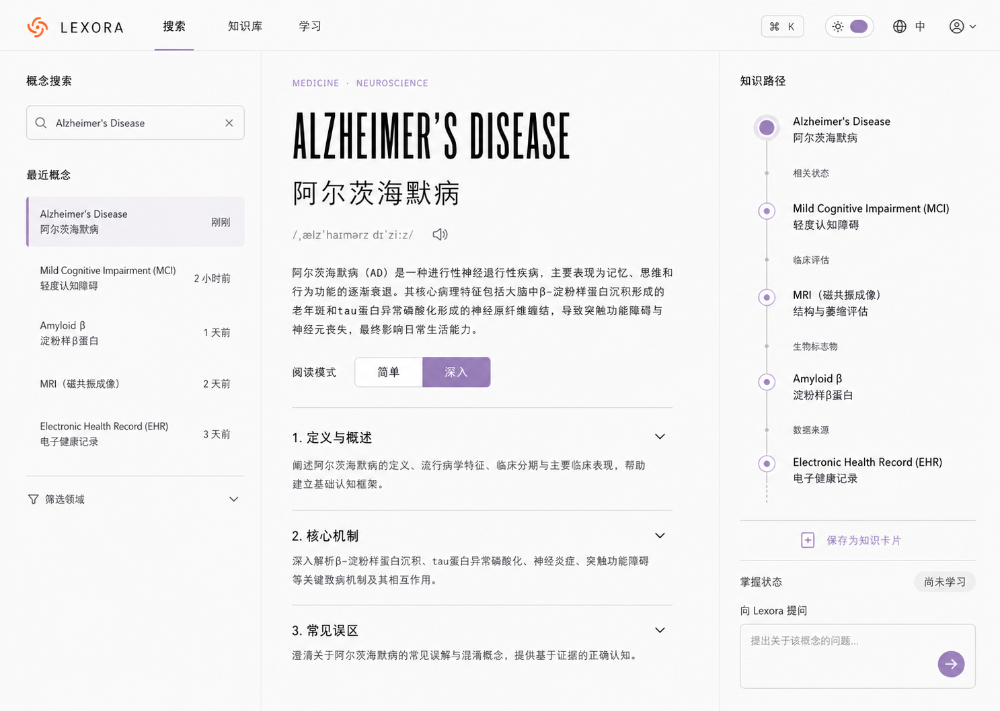
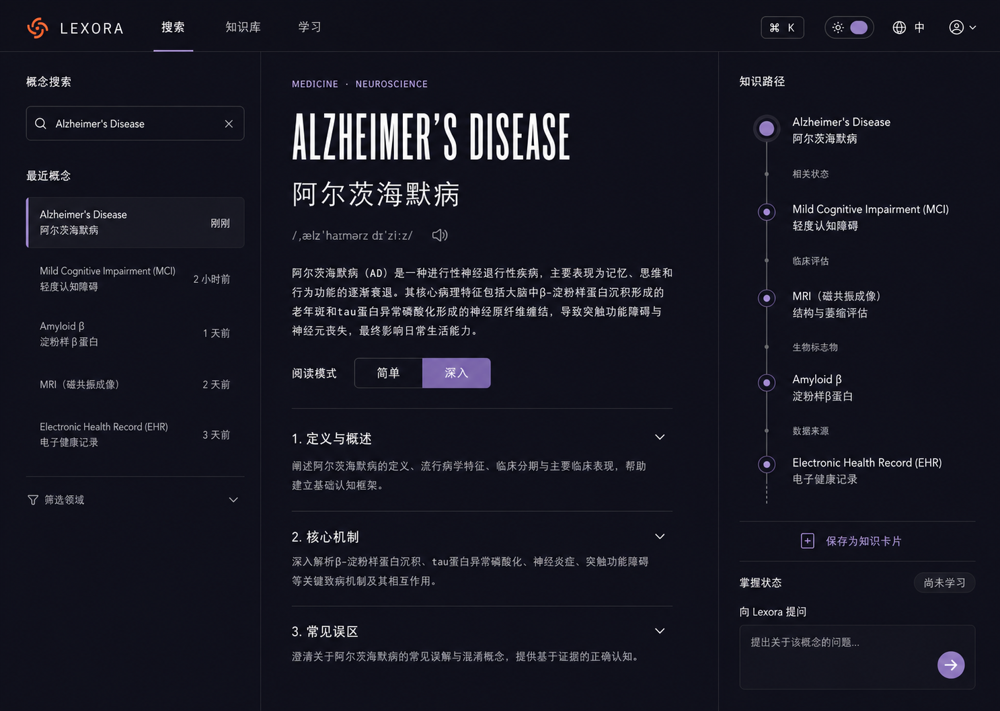

# Lexora Web UI Design Specification

> Product-only desktop web application design  
> Status: Approved visual direction, ready for implementation planning  
> Visual direction: Selected Option 2 — Temporal Knowledge Split  
> Primary platform: macOS desktop browser  
> Reference product: TemporalSync Light / Dark visual system  
> Last updated: 2026-07-20

---

## 1. Design outcome

Lexora Web is a standalone AI professional knowledge-learning product.

It is not:

- A TemporalSync subpage.
- A personal portfolio.
- A marketing landing page.
- A general-purpose AI chat interface.
- A dashboard filled with unrelated statistics.

The product UI only contains information and actions required for the Lexora learning loop:

```text
搜索概念
  → 理解概念
  → 查看知识关系
  → 保存知识卡片
  → AI 提问
  → 复习与更新掌握状态
```

The default post-login destination is **Search**, not Home. This removes a low-value dashboard step and puts the product's strongest interaction immediately in front of the user.

---

## 2. Approved visual baselines

### 2.1 Light mode



### 2.2 Dark mode



These images define the intended:

- Overall composition.
- Three-column information hierarchy.
- TemporalSync-derived visual identity.
- Light and dark theme relationship.
- Typography contrast.
- Density and whitespace.
- Placement of search, concept content, knowledge path, save, mastery, and Tutor entry.

They are directional source-of-truth images, not pixel-perfect implementation screenshots. Text rendering, line wrapping, and icon details should follow this document when the images and specification differ.

---

## 3. Design principles

### 3.1 Product first

Every visible element must support one of these jobs:

1. Find a concept.
2. Understand a concept.
3. Connect it to other concepts.
4. Save it for learning.
5. Review or ask a follow-up question.

Do not introduce generic landing-page sections, product announcements, social feeds, or vanity metrics into the authenticated application.

### 3.2 Editorial, not dashboard-heavy

Concept detail is long-form knowledge content. It should read like a concise academic reference with product controls layered around it.

Use:

- Typography.
- Spacing.
- Alignment.
- Hairline separators.
- Progressive disclosure.

Avoid:

- A card around every section.
- Cards inside cards.
- Large colored backgrounds behind ordinary text.
- Excessive pills and badges.
- Heavy shadows.

### 3.3 Connected, not decorative

Knowledge relationships must communicate:

- What is connected.
- How it is connected.
- Whether the related concept is saved or learned.

Orbit lines and geometric motifs are allowed as low-opacity brand texture, but they must not become a “space” or “galaxy” aesthetic.

### 3.4 Calm confidence

Lexora handles professional knowledge. The product should feel precise and calm:

- Strong typographic hierarchy.
- Restrained lavender accent.
- Small orange brand mark.
- Stable layouts.
- Minimal movement.
- Explicit uncertainty and source states.

### 3.5 Light and dark are equal products

Dark mode is not an inverted afterthought. Both themes must preserve:

- Information hierarchy.
- Visible boundaries.
- Readable long-form text.
- Focus states.
- Selected states.
- Disabled states.
- Relation-line legibility.

---

## 4. Product information architecture

### 4.1 Primary navigation

The authenticated product has three primary destinations:

| Navigation item | Purpose | Default shortcut |
|---|---|---|
| 搜索 | Search, disambiguate, and read concepts | `⌘ K` |
| 知识库 | Browse saved concepts and knowledge relationships | `G` then `K` optional |
| 学习 | Review due cards and inspect learning progress | `G` then `L` optional |

Search is the default destination after login.

### 4.2 Secondary navigation

Secondary utilities live on the right side of the header:

- Keyboard shortcut hint.
- Light / dark / system theme control.
- Language control.
- Account menu.

The account menu contains:

- Profile.
- Preferences.
- Data export.
- Privacy and AI notice.
- Sign out.
- Delete account.

Settings should not occupy a permanent primary navigation item.

### 4.3 Removed navigation

Do not include:

- Home.
- About.
- Work.
- Blog.
- Marketing.
- Contact.
- Email.
- Social.
- TemporalSync.

---

## 5. App shell

## 5.1 Desktop canvas

Primary design viewport:

```text
1440 × 1024
```

Supported desktop range:

```text
1280–1920 px width
```

The app fills the viewport. Do not place the entire app inside a centered rounded container.

### 5.2 Header

| Property | Value |
|---|---|
| Height | 72 px |
| Position | Sticky, top 0 |
| Z-index | 50 |
| Horizontal padding | 40 px at ≥1440; 28 px at 1280 |
| Background | Theme canvas with 96–98% opacity |
| Bottom border | 1 px semantic hairline |
| Backdrop blur | Optional 12 px only when content scrolls underneath |

Header regions:

```text
[Brand] [Primary navigation]                     [Utilities] [Account]
```

Recommended widths:

- Brand: 160 px.
- Primary navigation: content width.
- Flexible spacer.
- Utilities: content width.

### 5.3 Three-column workspace

At 1440 px:

| Region | Width | Behavior |
|---|---:|---|
| Search rail | 320 px | Fixed |
| Concept reader | `minmax(640px, 1fr)` | Flexible |
| Knowledge rail | 360 px | Fixed |

Main workspace height:

```text
calc(100dvh - 72px)
```

Each column may scroll independently only when necessary:

- Search rail: independent vertical scroll.
- Concept reader: primary document scroll.
- Knowledge rail: independent scroll if content exceeds viewport.

Avoid nested scroll areas inside each column.

### 5.4 Column dividers

- 1 px semantic hairline.
- No shadow.
- Divider remains visible in both themes.
- Divider runs from below the header to the viewport bottom.

### 5.5 Content padding

| Region | Horizontal padding | Top padding |
|---|---:|---:|
| Search rail | 36 px | 36 px |
| Concept reader | 46 px | 42 px |
| Knowledge rail | 32 px | 36 px |

At ≥1600 px, concept reader horizontal padding may grow to 56 px, but readable text width must remain bounded.

---

## 6. Responsive behavior

### 6.1 Wide desktop: ≥1600 px

- Search rail: 340 px.
- Knowledge rail: 380 px.
- Concept content remains max 760 px wide.
- Extra width becomes whitespace, not oversized paragraphs.

### 6.2 Standard desktop: 1280–1599 px

- Use the standard three-column layout.
- Search rail may reduce to 280 px.
- Knowledge rail may reduce to 320 px.
- Concept title may reduce one type step.

### 6.3 Compact desktop/tablet landscape: 1024–1279 px

- Search rail becomes a collapsible drawer.
- Concept reader remains visible.
- Knowledge rail remains 320 px.
- Header navigation uses labels until space is insufficient.
- `⌘ K` opens search drawer.

### 6.4 Tablet portrait: 768–1023 px

- Single main concept column.
- Search opens as a left sheet/drawer.
- Knowledge path opens as a right sheet/drawer.
- Save action becomes a sticky bottom action row.
- Do not render the full three-column composition squeezed into the viewport.

### 6.5 Mobile: <768 px

Mobile is not the initial product priority, but the web UI must not break:

- Header becomes brand + search + account.
- Primary navigation becomes a bottom navigation or compact menu.
- Concept title uses a non-display fallback size.
- Knowledge path becomes a vertical section after concept content.
- Tutor opens as a full-height sheet.

No desktop hover interaction may be required to access essential information.

---

## 7. Design tokens

## 7.1 Color philosophy

Use semantic tokens in components. Never hard-code theme-specific colors inside individual component styles.

### 7.2 Light theme

| Semantic token | Value | Use |
|---|---|---|
| `canvas` | `#FAFAFA` | App background |
| `surface` | `#FFFFFF` | Inputs, selected areas, interactive surfaces |
| `surface-elevated` | `#F4F4F5` | Hover, selected neutral, popovers |
| `ink` | `#1D1D1F` | Primary text |
| `body` | `#6E6E73` | Body/supporting text |
| `muted` | `#86868B` | Metadata, placeholders |
| `muted-soft` | `#D4D4D8` | Disabled icons, decorative lines |
| `hairline` | `rgba(0,0,0,0.08)` | Primary borders |
| `hairline-soft` | `rgba(0,0,0,0.04)` | Subtle separators |
| `shadow` | `0 4px 20px rgba(0,0,0,0.05)` | Popovers only |

### 7.3 Dark theme

| Semantic token | Value | Use |
|---|---|---|
| `canvas` | `#120D26` | App background |
| `surface` | `#12121A` | Inputs and primary surfaces |
| `surface-elevated` | `#1C1C24` | Hover, selected neutral, popovers |
| `ink` | `#F5F5F7` | Primary text |
| `body` | `#A1A1A6` | Long-form body text |
| `muted` | `#86868B` | Metadata, placeholders |
| `muted-soft` | `#48484E` | Disabled/decorative lines |
| `hairline` | `#242728` | Primary borders |
| `hairline-soft` | `rgba(36,39,40,0.20)` | Subtle separators |
| `shadow` | `0 4px 24px rgba(0,0,0,0.35)` | Popovers only |

The body token is raised slightly above the TemporalSync muted value in dark mode because Lexora contains longer educational text.

### 7.4 Brand and interaction colors

| Token | Value | Use |
|---|---|---|
| `brand-orange` | `#FF5A1F` | Lexora mark only |
| `accent` | `#B497CF` | Primary action, selection, focus |
| `accent-hover-light` | `#A989C7` | Light-mode hover |
| `accent-hover-dark` | `#C3A9DB` | Dark-mode hover |
| `accent-soft-light` | `rgba(180,151,207,0.12)` | Selected row background |
| `accent-soft-dark` | `rgba(180,151,207,0.14)` | Selected row background |
| `accent-border` | `rgba(180,151,207,0.55)` | Selected outline |

The orange mark must not spread into buttons, active tabs, graph nodes, or large backgrounds.

### 7.5 Status colors

Status always combines color with text or icon:

| State | Color | Supporting signal |
|---|---|---|
| New | Neutral | “尚未学习” label |
| Learning | Lavender | Half-filled circle + “学习中” |
| Mastered | Muted green `#5A9E6F` | Check icon + “已掌握” |
| Needs review | Warm amber `#D4A44A` | Clock icon + “待复习” |
| Error | Muted red `#C66058` | Error icon + message |
| Low confidence | Warm amber | Warning icon + “需要核验” |

Never communicate mastery or confidence by color alone.

---

## 8. Typography

## 8.1 Font families

### Display and navigation

```text
"Roboto Condensed", "Arial Narrow", sans-serif
```

Use for:

- English concept title.
- Primary navigation.
- Small uppercase category labels.
- Compact English metadata.

### Product and reading text

```text
"Myriad Pro", -apple-system, BlinkMacSystemFont,
"Segoe UI", "PingFang SC", "Noto Sans CJK SC",
Helvetica, Arial, sans-serif
```

Use for:

- Chinese titles.
- Chinese body text.
- Buttons.
- Inputs.
- Form labels.
- Metadata.

Do not use more than these two font systems.

## 8.2 Type scale

| Style | Desktop size / line-height | Weight | Tracking |
|---|---|---:|---:|
| Display XL | 64 / 68 px | 700 | `0.01em` |
| Chinese title | 36 / 44 px | 500 | `0` |
| H1 | 28 / 36 px | 600 | `0` |
| H2 | 21 / 28 px | 600 | `0` |
| H3 | 17 / 24 px | 600 | `0` |
| Body | 15.3 / 25 px | 400 | `0.005em` |
| Body strong | 15.3 / 25 px | 600 | `0` |
| UI | 15 / 20 px | 500 | `0` |
| Metadata | 13 / 18 px | 400 | `0.02em` |
| Overline | 12 / 16 px | 600 | `0.10em` |
| Navigation | 15 / 20 px | 500 | `0.08em` |

### 8.3 Long-form reading rules

- Target line length: 45–65 Chinese characters or equivalent.
- Paragraph gap: 16 px.
- Section gap: 32–40 px.
- Avoid justified alignment.
- English abbreviations remain upright within Chinese text.
- Use a space around Latin abbreviations where Chinese readability benefits.
- Never use pure muted gray for primary educational paragraphs.

---

## 9. Spacing, shape, and elevation

## 9.1 Spacing scale

Base unit:

```text
4 px
```

Allowed scale:

```text
4, 8, 12, 16, 20, 24, 32, 40, 48, 64
```

Avoid arbitrary values unless required for optical alignment.

### 9.2 Radius scale

| Token | Value | Use |
|---|---:|---|
| `radius-sm` | 6 px | Small controls, chips |
| `radius-md` | 8 px | Inputs, buttons |
| `radius-lg` | 12 px | Popovers, selected panels |

Do not use 20–32 px “friendly SaaS” radii.

### 9.3 Borders

- Standard border: 1 px hairline.
- Selected left indicator: 3 px accent.
- Focus ring: 2 px accent with 2 px offset.
- Section separation: 1 px hairline-soft.

### 9.4 Shadows

Use shadows only for:

- Menus.
- Popovers.
- Modal or sheet surfaces.

Main layout, columns, accordions, list rows, and buttons should not rely on shadows.

---

## 10. Header components

## 10.1 Lexora brand

Composition:

```text
[Orange mark]  L E X O R A
```

Specifications:

- Mark: 28 × 28 px.
- Wordmark: 18 px, 500 weight, `0.18em` tracking.
- Gap: 14 px.
- Entire hit target: minimum 44 px height.
- Clicking brand returns to Search default state.

Do not reuse the TemporalSync wordmark or name.

### 10.2 Primary nav item

Dimensions:

- Height: 72 px.
- Horizontal padding: 20 px.
- Text baseline aligned with brand.

States:

| State | Treatment |
|---|---|
| Default | Ink at 80% |
| Hover | Ink at 100% |
| Active | Ink + 2 px lavender underline |
| Focus | Visible focus ring around hit area |
| Pressed | Ink + subtle surface-elevated background |

Active underline:

- Width matches text plus 12 px.
- Bottom aligned to header border.
- No animated sliding indicator between non-adjacent routes.

### 10.3 Keyboard hint

Display:

```text
⌘ K
```

- 52 × 34 px.
- Border: hairline.
- Radius: 8 px.
- Metadata type.
- Opens global concept search.

Hide below 1100 px.

### 10.4 Theme control

Behavior:

- Click toggles Light ↔ Dark.
- Secondary menu offers System.
- Persist preference.
- Initial load must avoid theme flash.

Visual:

- 68 × 34 px.
- Contains sun/moon icon and switch.
- Border: hairline.
- Active thumb: accent.
- Reduce Motion disables sliding animation.

### 10.5 Language control

- Shows globe + `中` or `EN`.
- Opens compact menu.
- Changes interface language, not the canonical language of stored concepts.
- Concept content can still display bilingual fields.

### 10.6 Account menu

Trigger:

- 36 × 36 px icon button.
- No avatar required in MVP.

Menu:

- Width: 240 px.
- Right aligned.
- Uses surface-elevated and shadow token.
- Destructive delete-account action is not shown in the first-level menu; it lives in settings.

---

## 11. Search rail

## 11.1 Purpose

The left rail supports:

- Starting a new concept search.
- Returning to a recent concept.
- Applying a small domain filter.

It is not a file tree, chat history, or folder system.

### 11.2 Section title

Text:

```text
概念搜索
```

- H3 style.
- 24 px bottom gap before the input.

### 11.3 Search input

Desktop dimensions:

- Width: 100%.
- Height: 52 px.
- Radius: 8 px.
- Horizontal padding: 14 px.
- Icon: 18 px.

Contents:

```text
[Search icon] [Query]                         [Clear]
```

Behavior:

- Focus on `⌘ K`.
- Search suggestions begin after 2 characters.
- Debounce remote lookup by 250–350 ms.
- Pressing `Esc` clears suggestions first, then releases focus.
- Pressing `Enter` selects the highlighted result.
- Clear button appears only when input contains text.

States:

| State | Treatment |
|---|---|
| Default | Surface + hairline |
| Hover | Stronger hairline |
| Focus | Accent border + focus ring |
| Loading | Small inline spinner; input remains editable |
| Error | Error border + message below |
| Disabled | Not expected in normal product flow |

### 11.4 Search suggestions

Suggestion popover:

- Opens below the input.
- Same width as input.
- Max height: 420 px.
- Result row: 64 px minimum.
- Use surface-elevated.

Groups:

1. Exact match.
2. Other meanings.
3. Related concepts.
4. “使用 AI 解释此术语” action.

Each result displays:

- Canonical English name.
- Chinese name.
- Domain overline.
- Match reason only when useful.

### 11.5 Recent concepts

Heading:

```text
最近概念
```

Maximum visible rows:

```text
6
```

Row dimensions:

- Minimum height: 72 px.
- Horizontal padding: 16 px.
- Vertical padding: 12 px.
- No default enclosing card.

Row content:

- English canonical name.
- Chinese name.
- Relative recency.

Selected row:

- Accent-soft background.
- 3 px accent line on the left.
- Ink text.

Hover:

- Surface-elevated.

Do not place “清除历史” as a prominent persistent action. It may exist in an overflow menu with confirmation.

### 11.6 Domain filter

Collapsed default:

```text
[Filter icon] 筛选领域                          [Chevron]
```

Expanded options:

- All.
- Medicine.
- AI / ML.
- Biology.
- Engineering.

V1 supports single selection. Multi-select filtering is unnecessary.

---

## 12. Concept reader

## 12.1 Purpose

The center column is the primary experience. It must answer:

1. What is this?
2. Why does it matter?
3. How deeply do I want to understand it now?

Controls must never dominate the concept itself.

### 12.2 Category overline

Example:

```text
MEDICINE · NEUROSCIENCE
```

- Overline style.
- Accent color.
- English uppercase.
- 24 px bottom gap.

### 12.3 Concept title group

Order:

1. English canonical term.
2. Chinese canonical term.
3. Pronunciation.

English title:

- Display XL.
- Maximum two lines.
- Use balanced wrapping.
- At 1280 px, reduce to 54 / 58 px.

Chinese title:

- Chinese title style.
- 18 px below English title.

Pronunciation row:

- 24 px below Chinese title.
- IPA uses metadata style.
- Speaker button: 36 × 36 px.
- Button announces play/pause state to assistive technology.

### 12.4 Concise definition

- 32 px above and below.
- Body style.
- Maximum 4 lines at the default reading width.
- No tinted card.
- First occurrence of acronym can be semibold.

### 12.5 Reading mode control

Options:

- 简单.
- 深入.

Dimensions:

- Total width: 200 px.
- Height: 44 px.
- Each option: equal width.
- Border: hairline.
- Radius: 8 px.

Selected option:

- Accent fill.
- Ensure text contrast.

Behavior:

- Switching mode replaces or expands explanation content.
- It must not reset page scroll to the top.
- Preserve choice per concept during the session.
- URL may encode `?depth=simple|deep` for shareable state.

### 12.6 Explanation accordions

V1 sections:

1. 定义与概述.
2. 核心机制.
3. 常见误区.

Optional later sections:

- 应用与示例.
- 相关测量.
- 参考来源.

Accordion row:

- Minimum header height: 64 px.
- Section number and title at left.
- Chevron at right.
- Divider above or below.

Expanded body:

- 12 px below title.
- 24 px bottom padding.
- Maximum readable width.
- Lists allowed only where semantics require them.

Interaction:

- Entire header is clickable.
- Keyboard: `Enter` or `Space`.
- `aria-expanded` reflects state.
- Multiple sections may remain open.

Default:

- Simple mode: first section open.
- Deep mode: first two sections open.

### 12.7 References

References appear after explanation content, not in the persistent right rail.

Each reference displays:

- Source title.
- Publisher or organization.
- Year/update date.
- External-link icon.

Do not render raw URLs as primary labels.

### 12.8 Content confidence

Content status appears near the references:

| Status | UI |
|---|---|
| Approved | Small “已核验” label |
| AI generated | “AI 生成 · 请结合来源判断” |
| Needs review | Warning icon + “需要核验” |
| Deprecated | Strong warning and newer concept link |

Never show a numeric confidence percentage as if it were scientific certainty.

---

## 13. Knowledge rail

## 13.1 Purpose

The right rail connects understanding to personal learning.

Order:

1. Knowledge path.
2. Save action.
3. Mastery state.
4. Ask Lexora.

### 13.2 Knowledge path

Heading:

```text
知识路径
```

Optional helper:

- Info icon explaining that the path is a selected learning route, not a causal chain.

Path structure:

```text
[Current concept]
      │ relationship label
[Related concept]
      │ relationship label
[Related concept]
```

Node row includes:

- State marker.
- English canonical name.
- Chinese name.
- Relationship label between nodes.

State marker:

- 24 px outer circle.
- 10 px inner indicator.
- Non-color state icon or fill pattern.

Path connector:

- 1 px line.
- Hairline/muted color.
- Dotted extension when more nodes exist below.

Click behavior:

- Single click previews the related concept.
- Explicit secondary action opens it in the concept reader.
- The current center concept uses a filled accent marker.

V1 path length:

```text
4–6 nodes
```

Do not show more than 8 nodes in the rail.

### 13.3 Save as Knowledge Card

Before save:

```text
[Plus/bookmark icon] 保存为知识卡片
```

After save:

```text
[Check icon] 已保存到知识库
```

Dimensions:

- Full rail width.
- Height: 48 px.
- Radius: 8 px.

Priority:

- Primary action in the right rail.
- Accent outline or fill.
- Do not compete with the concept title.

Behavior:

1. Click save.
2. Immediately show optimistic saved state.
3. Create the default card.
4. Show a subtle confirmation toast.
5. Expose “查看卡片” as a secondary action.

Failure:

- Revert optimistic state.
- Inline error below button.
- Preserve user context.

### 13.4 Mastery state

Layout:

```text
掌握状态                                  [尚未学习]
```

Available states:

- 尚未学习.
- 学习中.
- 待复习.
- 已掌握.

The state is not directly editable from a simple dropdown in V1. It changes through save and review behavior.

### 13.5 Ask Lexora

Label:

```text
向 Lexora 提问
```

Input:

- Minimum height: 96 px.
- Maximum automatic growth: 180 px.
- Submit button: 40 × 40 px.
- Placeholder: `提出关于该概念的问题…`

Suggested prompts appear only when the conversation is empty:

- “用更简单的方式解释”
- “它和 MCI 有什么区别？”
- “给我一个具体例子”

Do not show more than three suggestions.

Behavior:

- Submit opens an anchored Tutor panel or expands the right rail.
- `Enter` submits only when the field is single-line; for textarea use `⌘ Enter`.
- Streaming answer shows a stable text cursor without layout jumping.
- References appear below the answer.

Medical safety:

- A compact educational-use note appears below the input or first answer.
- Do not repeat a large disclaimer on every message.

---

## 14. Knowledge Library page

## 14.1 Page goal

Help users return to saved concepts and understand the shape of their knowledge without turning the page into a statistics dashboard.

### 14.2 Header

- Page title: `知识库`.
- Search saved concepts.
- View toggle: List / Relations.
- Filter: Domain and mastery.

### 14.3 List view

Default view for usability.

Columns:

- Concept.
- Domain.
- Mastery.
- Last reviewed.
- Next review.

Row behavior:

- Opens Concept Detail.
- Hover exposes a quiet overflow menu.
- Multi-select is deferred.

Default sort:

```text
Last activity descending
```

### 14.4 Relations view

- Focused graph around a selected concept.
- Maximum 12 visible nodes initially.
- Saved/learning/mastered states use marker patterns and labels.
- Accessible list is always available.
- Selecting a node opens a right inspector.

Do not render the entire global graph.

### 14.5 Empty state

Copy:

```text
你的知识网络从第一个概念开始。
```

Primary action:

```text
搜索一个概念
```

No illustration is required. A subtle orbit line motif is sufficient.

---

## 15. Learning page

## 15.1 Page goal

Make review feel short, focused, and professional.

### 15.2 Learning overview

Show only:

- Due today.
- Learning.
- Mastered.
- Start review.

These may be compact values in one horizontal summary, not separate decorative cards.

### 15.3 Review session

Desktop composition:

```text
[Progress / queue]       [Focused review card]       [Concept context]
```

Primary review card:

1. Question.
2. Optional answer field.
3. Reveal answer.
4. AI feedback.
5. Again / Hard / Good / Easy.

Do not show all steps simultaneously.

### 15.4 Rating controls

| Rating | Meaning | Visual |
|---|---|---|
| Again | Not recalled | Neutral/error text |
| Hard | Recalled with difficulty | Warm muted |
| Good | Correct recall | Accent outline |
| Easy | Immediate recall | Success outline |

Keyboard:

- `1` Again.
- `2` Hard.
- `3` Good.
- `4` Easy.
- `Space` Reveal answer.

### 15.5 Session completion

Show:

- Cards reviewed.
- Due next.
- One calm completion sentence.

Do not use confetti, streak pressure, or competitive ranking.

---

## 16. Authentication and onboarding

## 16.1 Sign-in page

Use a quiet split layout:

- Left: Lexora proposition and subtle orbit motif.
- Right: Sign in with Apple.

Copy:

```text
把陌生概念变成你的知识网络。
```

Do not place the authenticated three-column app behind a fake glass login card.

### 16.2 Onboarding

Maximum three steps:

1. Preferred interface language.
2. Learning domains.
3. Daily review goal.

Every step is skippable except language.

No personality quiz or lengthy AI configuration.

---

## 17. Component state matrix

Every interactive component must define:

| State | Required |
|---|---|
| Default | Yes |
| Hover | Desktop yes |
| Focus visible | Yes |
| Pressed | Yes |
| Selected | When applicable |
| Disabled | When applicable |
| Loading | For async actions |
| Error | For async/form actions |
| Empty | For lists/content |

### 17.1 Loading principles

- Preserve layout dimensions during load.
- Use text skeletons only for unknown remote content.
- Use a small spinner for button actions.
- Do not replace the entire app with a global spinner after initial authentication.

### 17.2 Skeleton style

- Surface-elevated background.
- No animated shimmer in Reduce Motion.
- Match final text line lengths approximately.
- Maximum skeleton duration before explanatory fallback: 10 seconds.

### 17.3 Empty states

Empty states contain:

1. One sentence explaining what is absent.
2. One primary next action.
3. Optional small supporting note.

No decorative feature inventory.

### 17.4 Error states

Errors must answer:

1. What failed?
2. What can the user do?
3. Was their work preserved?

Example:

```text
暂时无法生成解释。你的搜索内容已保留，请稍后重试。
```

---

## 18. Search and generation states

### 18.1 Existing concept found

- Load cached content immediately.
- Show content update date.
- No “AI is thinking” theatrics.

### 18.2 Ambiguous term

The center reader becomes a disambiguation view:

```text
“Embedding” 可能指：
```

Show 2–4 senses as plain selectable rows:

- Machine learning.
- Mathematics.
- Linguistics.

Do not generate all meanings simultaneously.

### 18.3 New concept generation

Stages:

1. Resolving term.
2. Building explanation.
3. Finding related concepts.

Use one compact progress panel in the concept reader.

Do not show fake token streams as final structured content.

### 18.4 Low-confidence result

- Display warning near category overline.
- Keep save action available only if policy permits.
- Show sources prominently.
- Offer “完善搜索上下文”.

---

## 19. Theme behavior

## 19.1 Theme modes

Supported values:

- Light.
- Dark.
- System.

### 19.2 Persistence

- Persist locally before authentication.
- Sync preference to profile after authentication.
- Local preference wins for immediate rendering.

### 19.3 Theme transition

Normal:

```text
background 300 ms
color 220 ms
border-color 260 ms
```

Use an ease-out curve.

Reduce Motion:

```text
0–50 ms
```

Do not animate every nested child independently for 800 ms. Theme changes must feel responsive.

### 19.4 Dark-mode content rules

- Long-form body uses `#A1A1A6`, not the more muted `#86868B`.
- Primary headings remain `#F5F5F7`.
- Input backgrounds use `surface`, not transparent black.
- Hairlines use `#242728`.
- Lavender button text must meet contrast requirements.
- Geometric lines remain under 12% opacity.

### 19.5 Light-mode content rules

- Canvas is `#FAFAFA`, not pure white everywhere.
- Main reader may visually blend with canvas.
- Inputs use white surface.
- Selected rows use accent-soft, not a heavy filled lavender block.
- Orbit geometry remains under 7% opacity.

---

## 20. Iconography

Use a consistent line icon library such as Lucide.

Default:

- 18 or 20 px.
- 1.5–1.75 px stroke.
- Round caps and joins.

Use icons for:

- Search.
- Clear.
- Speaker.
- Bookmark/save.
- Theme.
- Language.
- Account.
- Filter.
- Chevron.
- Send.
- Info.
- External link.
- Status.

Do not use:

- Emoji.
- Hand-drawn approximate SVGs.
- Mixed filled and outlined libraries.
- Icons without accessible labels when the meaning is not obvious.

---

## 21. Motion

Motion supports orientation, not spectacle.

| Interaction | Duration |
|---|---:|
| Hover color | 120 ms |
| Button press | 80 ms |
| Accordion | 180–220 ms |
| Drawer/sheet | 240–280 ms |
| Popover | 140–180 ms |
| Theme transition | 220–300 ms |

Easing:

```text
cubic-bezier(0, 0, 0.2, 1)
```

Avoid:

- Floating graph nodes.
- Continuous pulsing.
- Parallax in the application.
- Large scroll-triggered reveal animations.
- Content shifting while Tutor streams.

---

## 22. Accessibility

## 22.1 Keyboard

All functionality must be available by keyboard.

Required:

- Logical tab order: header → search rail → concept reader → knowledge rail.
- Skip link to main concept content.
- `⌘ K` global search.
- `Esc` closes drawers/popovers.
- Arrow-key navigation in search suggestions.
- Accordion activation with Enter/Space.

### 22.2 Focus

- Focus ring is always visible for keyboard interaction.
- 2 px accent ring with 2 px offset.
- Do not remove outlines without a replacement.
- Focus must remain visible in both themes.

### 22.3 Screen readers

- Page announces concept title as H1.
- Column landmarks have labels.
- Knowledge path is exposed as an ordered list.
- Relation labels are included in accessible names.
- Theme toggle announces current theme.
- Audio button announces play/pause state.
- Tutor streaming uses a polite live region, not assertive per-token announcements.

### 22.4 Contrast

Targets:

- Normal text: WCAG AA 4.5:1.
- Large text: 3:1.
- Interactive component boundaries: 3:1 where required.
- Focus indication: clearly distinguishable.

Muted text must not contain essential instructions below contrast targets.

### 22.5 Text scaling

- Support browser zoom to 200%.
- No clipped header actions at 200%.
- Columns may collapse to responsive mode as zoom increases.
- Avoid fixed-height long-form text containers.

---

## 23. Content design

## 23.1 Language hierarchy

For English-origin professional concepts:

1. English canonical term.
2. Chinese canonical translation.
3. English pronunciation.
4. Chinese explanation.

For Chinese-origin searches, the resolved canonical concept still follows the same detail hierarchy when an English canonical term exists.

### 23.2 Terminology

Use consistent UI vocabulary:

| Preferred | Avoid |
|---|---|
| 概念 | 单词 |
| 知识卡片 | 生词卡 |
| 知识路径 | 关系链路、关系拓扑 |
| 掌握状态 | 等级 |
| 深入 | 专家模式 |
| 相关概念 | 推荐词 |
| 参考来源 | 引用资料库 |

### 23.3 Tone

Lexora is:

- Direct.
- Calm.
- Precise.
- Educational.
- Honest about uncertainty.

Avoid:

- “秒懂”.
- “绝对正确”.
- “AI 已为你掌握”.
- Gamified pressure.
- Overly enthusiastic success copy.

### 23.4 Medical copy

Medical content includes a restrained educational notice:

```text
内容仅用于知识学习，不构成诊断或治疗建议。
```

It appears:

- Near references.
- In the Tutor's first relevant answer.
- In product policy/settings.

Do not place a large red banner above every concept.

---

## 24. Notifications and feedback

### 24.1 Toasts

Use for:

- Concept saved.
- Copy successful.
- Preference changed.
- Retry scheduled.

Specifications:

- Bottom center or top-right depending on viewport.
- Maximum width: 360 px.
- Visible 3–5 seconds.
- Pauses on hover.
- Does not obscure Tutor input.

### 24.2 Inline feedback

Use inline messages for:

- Search error.
- Generation failure.
- Save failure.
- Tutor request failure.
- Low-confidence content.

Do not use toast-only feedback when the user must take corrective action.

### 24.3 Confirmation dialogs

Required only for:

- Delete account.
- Delete user-created note with unsaved work.
- Clear all history.

Saving, unsaving, changing theme, and starting review do not need confirmation dialogs.

---

## 25. URL and navigation behavior

Suggested route model:

```text
/search
/concept/:slug
/knowledge
/learning
/settings
```

Concept state:

```text
/concept/alzheimers-disease?depth=deep
```

Requirements:

- Browser back restores previous query and scroll position.
- Concept selection updates the URL.
- Opening a related concept preserves useful navigation context.
- Search query may be represented in URL when safe.
- Tutor draft is not stored in URL.

---

## 26. MVP design scope

### Included

- Standalone product shell.
- Search.
- Concept disambiguation.
- Concept detail.
- Simple/deep explanation.
- Pronunciation.
- Related concept path.
- Save knowledge card.
- Mastery state.
- Tutor entry.
- Knowledge Library list and focused relations.
- Learning review.
- Account/settings access.
- Light/dark/system themes.
- Desktop responsive behavior.
- Loading, empty, error, and confidence states.

### Excluded

- Marketing landing page.
- Pricing.
- Community.
- Social profile.
- Public sharing.
- Collaborative spaces.
- Custom decks.
- Complex graph analytics.
- Full paper PDF workspace.
- Browser extension.
- Mobile-native navigation polish.

---

## 27. Implementation handoff checklist

Before frontend implementation begins:

- [ ] Confirm approved Light and Dark baselines.
- [ ] Confirm Roboto Condensed loading strategy.
- [ ] Confirm Lexora logo asset.
- [ ] Confirm exact Chinese product terminology.
- [ ] Confirm desktop breakpoint strategy.
- [ ] Confirm search result API states.
- [ ] Confirm concept content schema.
- [ ] Confirm relation types displayed in Knowledge Path.
- [ ] Confirm save-card state contract.
- [ ] Confirm Tutor panel behavior.
- [ ] Confirm review scheduling labels.
- [ ] Confirm accessibility acceptance criteria.

During implementation:

- [ ] Use semantic theme tokens.
- [ ] Match 72 px header.
- [ ] Match three-column desktop proportions.
- [ ] Bound the concept reading width.
- [ ] Avoid additional dashboard cards.
- [ ] Implement all component states.
- [ ] Verify keyboard navigation.
- [ ] Verify 200% zoom.
- [ ] Verify Light and Dark independently.
- [ ] Verify loading without layout shift.
- [ ] Verify long English and Chinese concept names.

Before UI acceptance:

- [ ] Compare implementation screenshot against the Light baseline.
- [ ] Compare implementation screenshot against the Dark baseline.
- [ ] Test at 1440 × 1024.
- [ ] Test at 1280 × 800.
- [ ] Test at 1024 × 768.
- [ ] Test empty, loading, error, saved, learning, and mastered states.
- [ ] Test reduced motion.
- [ ] Test keyboard-only search and review.
- [ ] Test screen-reader order.
- [ ] Confirm no TemporalSync or portfolio content appears.

---

## 28. Visual acceptance criteria

The UI is accepted when:

1. Lexora reads immediately as a standalone product.
2. Search is the dominant entry point.
3. The center concept is visually primary.
4. The relation path is understandable without reading documentation.
5. Save and Tutor actions are easy to find but do not dominate the article.
6. Light mode feels editorial and precise rather than sterile.
7. Dark mode retains TemporalSync's deep-violet identity without sacrificing reading comfort.
8. The interface contains no unrelated personal-site or marketing information.
9. The design remains calm with realistic content.
10. The interface is fully usable with keyboard, zoom, and assistive technology.

---

## 29. Final design decision

Lexora Web will use:

- A product-only authenticated shell.
- Three primary destinations: Search, Knowledge, Learning.
- Search as the default entry.
- A three-column concept workspace on desktop.
- TemporalSync-derived typography, spacing, deep-violet dark theme, and restrained lavender accent.
- Equal Light and Dark implementations.
- Editorial content hierarchy instead of dashboard-card density.

This is the UI baseline for the first implementation phase.
